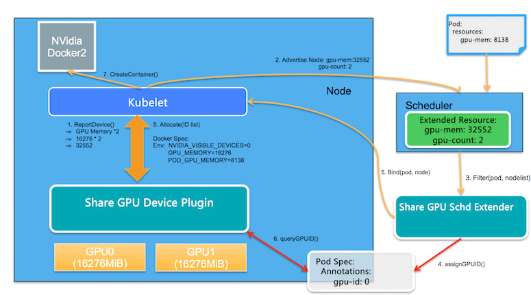
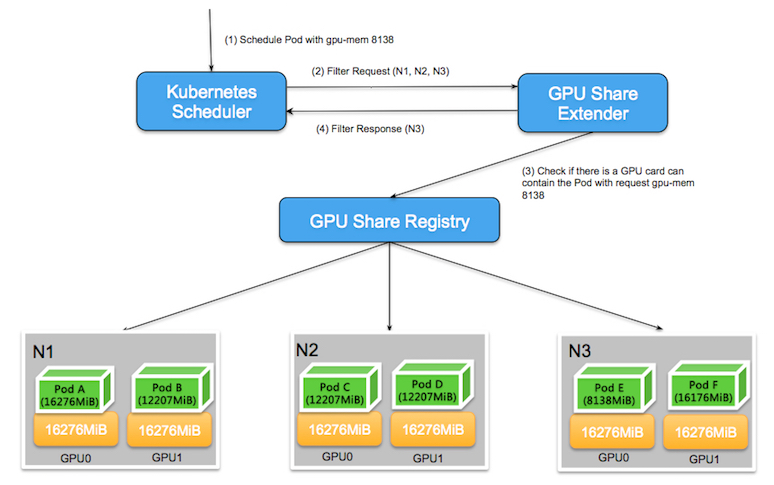
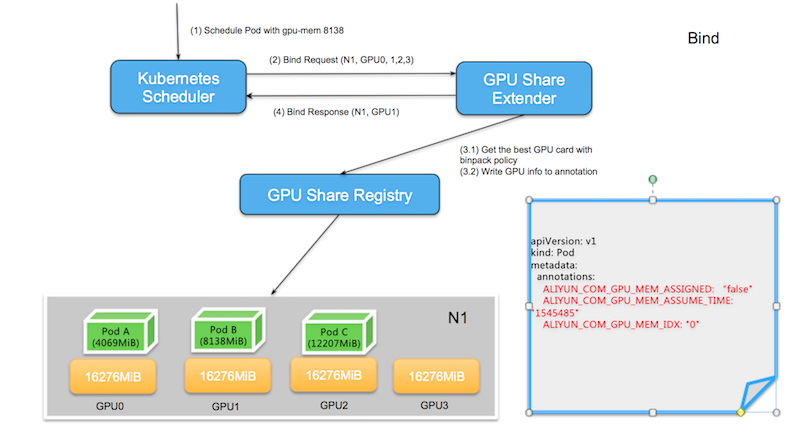
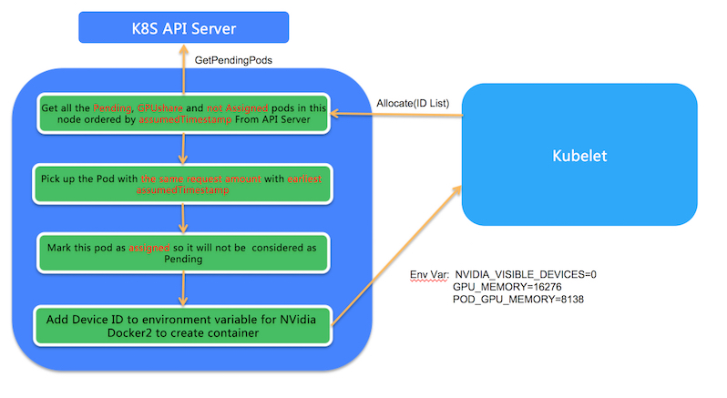

# 问题背景
全球主要的容器集群服务厂商的Kubernetes服务都提供了Nvidia GPU容器调度能力，但是通常都是将一个GPU卡分配给一个容器。这可以实现比较好的隔离性，确保使用GPU的应用不会被其他应用影响；对于深度学习模型训练的场景非常适合，但是如果对于模型开发和模型预测的场景就会比较浪费。 大家的诉求是能够让更多的预测服务共享同一个GPU卡上，进而提高集群中Nvidia GPU的利用率。而这就需要提供GPU资源的划分，而这里GPU资源划分的维度指的就是GPU显存和Cuda Kernel线程的划分。通常在集群级别谈支持共享GPU，通常是两件事情：

<!-- more -->

1.调度
2.隔离，我们这里主要讨论的是调度，隔离的方案未来会基于Nvidia的MPS来实现。

而对于细粒度的GPU卡调度，目前Kubernetes社区并没有很好的方案，这是由于Kubernetes对于GPU这类扩展资源的定义仅仅支持整数粒度的加加减减，无法支持复杂资源的分配。比如用户希望使用Pod A占用半张GPU卡，这在目前Kubernetes的架构设计中无法实现资源分配的记录和调用。这里挑战是多卡GPU共享是实际矢量资源问题，而Extened Resource是标量资源的描述。

针对此问题，我们设计了一个outoftree的共享GPU调度方案，该方案依赖于Kubernetes的现有工作机制:

>1. Extended Resource定义
>2. Scheduler Extender机制
>3. Device Plugin机制

# 设计原则
>1. 明确问题简化设计，第一步只负责调度和部署，后续再实现运行时显存管控。
有很多的客户明确的诉求是首先可以支持多AI应用可以调度到同一个GPU上，他们可以接受从应用级别控制显存的大小，利用类似gpu_options.per_process_gpu_memory_fraction控制应用的显存使用量。那我们要解决的问题就先简化到以显存为调度标尺，并且把显存使用的大小以参数的方式传递给容器内部。
>2. 不做侵入式修改
本设计中不会修改Kubernetes核心的Extended Resource的设计， Scheduler的实现，Device Plugin的机制以及Kubelet的相关设计。重用Extended Resource描述共享资源的申请API。这样的好处在于提供一个可以移植的方案，用户可以在原生Kubernetes上使用这个方案。
>3. 按显存和按卡调度的方式可以在集群内并存，但是同一个节点内是互斥的，不支持二者并存；要么是按卡数目，要么是按显存分配。

# 详细设计

## 前提
>1. 依旧延用Kubernetes Extended Resource定义，但是衡量维度最小单位从1个GPU卡变为GPU显存的MiB。如果所节点使用的GPU为单卡16GiB显存，它对应的资源就是16276MiB
>2. 由于用户对于共享GPU的诉求在于模型开发和模型预测场景，在此场景下，用户申请的GPU资源上限不会超过一张卡，也就是申请的资源上限为单卡

而我们的工作首先是定义了两个新的Extended Resource： 第一个是gpu-mem， 对应的是GPU显存;第二个是gpu-count，对应的是GPU卡数。 通过两个标量资源描述矢量资源, 并且结合这一资源，提供支持共享GPU的工作机制。下面是基本的架构图：


## 核心功能模块

>-  GPU Share Scheduler Extender: 利用Kubernetes的调度器扩展机制，负责在全局调度器Filter和Bind的时候判断节点上单个GPU卡是否能够提供足够的GPU Mem，并且在Bind的时刻将GPU的分配结果通过annotation记录到Pod Spec以供后续Filter检查分配结果。
>- GPU Share Device Plugin: 利用Device Plugin机制，在节点上被Kubelet调用负责GPU卡的分配，依赖scheduler Extender分配结果执行。

## 具体流程

1. 资源上报

GPU Share Device Plugin利用nvml库查询到GPU卡的数量和每张GPU卡的显存， 通过ListAndWatch()将节点的GPU总显存（数量 显存）作为另外Extended Resource汇报给Kubelet； Kubelet进一步汇报给Kubernetes API Server。 举例说明，如果节点含有两块GPU卡，并且每块卡包含16276MiB，从用户的角度来看：该节点的GPU资源为16276 2 = 32552; 同时也会将节点上的GPU卡数量2作为另外一个Extended Resource上报。

2. 扩展调度

GPU Share Scheduler Extender可以在分配gpu-mem给Pod的同时将分配信息以annotation的形式保留在Pod spec中，并且在过滤时刻根据此信息判断每张卡是否包含足够可用的gpu-mem分配。

2.1 Kubernetes默认调度器在进行完所有过滤(filter)行为后会通过http方式调用GPU Share Scheduler Extender的filter方法, 这是由于默认调度器计算Extended Resource时，只能判断资源总量是否有满足需求的空闲资源，无法具体判断单张卡上是否满足需求；所以就需要由GPU Share Scheduler Extender检查单张卡上是否含有可用资源。

以下图为例， 在由3个包含两块GPU卡的节点组成的Kubernetes集群中，当用户申请gpu-mem=8138时，默认调度器会扫描所有节点，发现N1所剩的资源为 (16276 * 2 - 16276 -12207 = 4069 )不满足资源需求，N1节点被过滤掉。
而N2和N3节点所剩资源都为8138MiB，从整体调度的角度看，都符合默认调度器的条件；此时默认调度器会委托GPU Share Scheduler Extender进行二次过滤，在二次过滤中，GPU Share Scheduler Extender需要判断单张卡是否满足调度需求，在查看N2节点时发现该节点虽然有8138MiB可用资源，但是落到每张卡上看，GPU0和分别GPU1只有4069MiB的可用资源，无法满足单卡8138MiB的诉求。而N3节点虽然也是总共有8138MiB可用资源，但是这些可用资源都属于GPU0，满足单卡可调度的需求。由此，通过GPU Share Scheduler Extender的筛选就可以实现精准的条件筛选。


2.2 当调度器找到满足条件的节点，就会委托GPU Share Scheduler Extender的bind方法进行节点和Pod的绑定，这里Extender需要做的是两件事情

>- 以binpack的规则找到节点中最优选择的GPU卡id，此处的最优含义是对于同一个节点不同的GPU卡，以binpack的原则作为判断条件，优先选择空闲资源满足条件但同时又是所剩资源最少的GPU卡，并且将其作为ALIYUN_COM_GPU_MEM_IDX保存到Pod的annotation中；同时也保存该Pod申请的GPU Memory作为ALIYUN_COM_GPU_MEM_POD和ALIYUN_COM_GPU_MEM_ASSUME_TIME保存至Pod的annotation中，并且在此时进行Pod和所选节点的绑定。

***注意：这时还会保存ALIYUN_COM_GPU_MEM_ASSIGNED的Pod annotation，它被初始化为“false”。它表示该Pod在调度时刻被指定到了某块GPU卡，但是并没有真正在节点上创建该Pod。ALIYUN_COM_GPU_MEM_ASSUME_TIME代表了指定时间。***

如果此时发现分配节点上没有GPU资源符合条件，此时不进行绑定，直接不报错退出，默认调度器会在assume超时后重新调度。

>- 调用Kubernetes API执行节点和Pod的绑定
以下图为例，当GPU Share Scheduler Extender要把gpu-mem：8138的Pod和经过筛选出来的节点N1绑定，首先会比较不同GPU的可用资源，分别为GPU0(12207),GPU1(8138),GPU2(4069),GPU3(16276),其中GPU2所剩资源不满足需求，被舍弃掉；而另外三个满足条件的GPU中, GPU1恰恰是符合空闲资源满足条件但同时又是所剩资源最少的GPU卡，因此GPU1被选出。



3. 节点上运行

当Pod和节点绑定的事件被Kubelet接收到后，Kubelet就会在节点上创建真正的Pod实体，在这个过程中, Kubelet会调用GPU Share Device Plugin的Allocate方法, Allocate方法的参数是Pod申请的gpu-mem。而在Allocate方法中，会根据GPU Share Scheduler Extender的调度决策运行对应的Pod

3.1 会列出该节点中所有状态为Pending并且ALIYUN_COM_GPU_MEM_ASSIGNED为false的GPU Share Pod

3.2 选择出其中Pod Annotation的ALIYUN_COM_GPU_MEM_POD的数量与Allocate申请数量一致的Pod。如果有多个符合这种条件的Pod，就会选择其中ALIYUN_COM_GPU_MEM_ASSUME_TIME最早的Pod。

3.3 将该Pod的annotation ALIYUN_COM_GPU_MEM_ASSIGNED设置为true，并且将Pod annotation中的GPU信息转化为环境变量返回给Kubelet用以真正的创建Pod。



# 安装使用

## 前提条件
>1. 支持共享GPU调度的节点不能设置CPU Policy为static。
>2. 已通过kubectl工具连接专有版GPU集群。具体操作，请参见通过kubectl工具连接集群。

## 使用须知
|配置|	支持版本|
|---|---|
|Kubernetes|	1.12.6及其以上，仅支持专有版集群|
|NVIDIA驱动版本|	418.87.01及以上版本|
|Docker版本|	19.03.5以上|
|操作系统|	CentOS 7.x、Ubuntu 16.04和Ubuntu 18.04|
|支持显卡|	Tesla P4、Tesla P100、 Tesla T4和Tesla v100|

## 部署组件

[部署参考](https://github.com/AliyunContainerService/gpushare-scheduler-extender/blob/master/docs/install.md?spm=a2c6h.12873639.0.0.45c8464depvTmx&file=install.md)

### 部署 gpushare-schd-extender 组件

1. 创建scheduler-policy-config.json 文件
```json
{
  "kind": "Policy",
  "apiVersion": "v1",
  "extenders": [
    {
      "urlPrefix": "http://127.0.0.1:32766/gpushare-scheduler",
      "filterVerb": "filter",
      "bindVerb":   "bind",
      "enableHttps": false,
      "nodeCacheCapable": true,
      "managedResources": [
        {
          "name": "aliyun.com/gpu-mem",
          "ignoredByScheduler": false
        }
      ],
      "ignorable": false
    }
  ]
}
```
2. 在所用调度器节点kube-scheduler.yaml参数中添加策略配置文件参数
```sh
- --policy-config-file=/etc/kubernetes/scheduler-policy-config.json
```

3. 创建gpushare-schd-extender.yaml
```yaml
# rbac.yaml
---
kind: ClusterRole
apiVersion: rbac.authorization.k8s.io/v1
metadata:
  name: gpushare-schd-extender
rules:
- apiGroups:
  - ""
  resources:
  - nodes
  verbs:
  - get
  - list
  - watch
- apiGroups:
  - ""
  resources:
  - events
  verbs:
  - create
  - patch
- apiGroups:
  - ""
  resources:
  - pods
  verbs:
  - update
  - patch
  - get
  - list
  - watch
- apiGroups:
  - ""
  resources:
  - bindings
  - pods/binding
  verbs:
  - create
- apiGroups:
  - ""
  resources:
  - configmaps
  verbs:
  - get
  - list
  - watch
---
apiVersion: v1
kind: ServiceAccount
metadata:
  name: gpushare-schd-extender
  namespace: kube-system
---
kind: ClusterRoleBinding
apiVersion: rbac.authorization.k8s.io/v1
metadata:
  name: gpushare-schd-extender
  namespace: kube-system
roleRef:
  apiGroup: rbac.authorization.k8s.io
  kind: ClusterRole
  name: gpushare-schd-extender
subjects:
- kind: ServiceAccount
  name: gpushare-schd-extender
  namespace: kube-system

# deployment yaml
---
apiVersion: apps/v1
kind: Deployment
metadata:
  name: gpushare-schd-extender
  namespace: kube-system
  resourceVersion: "27297333"
spec:
  selector:
    matchLabels:
      app: gpushare
      component: gpushare-schd-extender
  strategy:
    type: Recreate
  template:
    metadata:
      annotations:
        scheduler.alpha.kubernetes.io/critical-pod: ""
      creationTimestamp: null
      labels:
        app: gpushare
        component: gpushare-schd-extender
    spec:
      containers:
      - env:
        - name: LOG_LEVEL
          value: debug
        - name: PORT
          value: "12345"
        image: hub.kce.ksyun.com/ksyun/gpushare-scheduler-extender:latest
        imagePullPolicy: Always
        name: gpushare-schd-extender
        resources: {}
        terminationMessagePath: /dev/termination-log
        terminationMessagePolicy: File
      dnsPolicy: ClusterFirst
      hostNetwork: true
      nodeSelector:
        node-role.kubernetes.io/master: ""
      restartPolicy: Always
      schedulerName: default-scheduler
      securityContext: {}
      serviceAccount: gpushare-schd-extender
      serviceAccountName: gpushare-schd-extender
      terminationGracePeriodSeconds: 30
      tolerations:
      - effect: NoSchedule
        key: node-role.kubernetes.io/master
        operator: Exists
      - effect: NoSchedule
        key: node.cloudprovider.kubernetes.io/uninitialized
        operator: Exists

# service.yaml            
---
apiVersion: v1
kind: Service
metadata:
  name: gpushare-schd-extender
  namespace: kube-system
  labels:
    app: gpushare
    component: gpushare-schd-extender
spec:
  type: NodePort
  ports:
  - port: 12345
    name: http
    targetPort: 12345
    nodePort: 32766
  selector:
    # select app=ingress-nginx pods
    app: gpushare
    component: gpushare-schd-extender
```

### 部署 gpushare-device-plugin 组件

```yaml
kind: ClusterRole
apiVersion: rbac.authorization.k8s.io/v1
metadata:
  name: gpushare-device-plugin
rules:
- apiGroups:
  - ""
  resources:
  - nodes
  - nodes/proxy
  verbs:
  - get
  - list
  - watch
- apiGroups:
  - ""
  resources:
  - events
  verbs:
  - create
  - patch
- apiGroups:
  - ""
  resources:
  - pods
  verbs:
  - update
  - patch
  - get
  - list
  - watch
- apiGroups:
  - ""
  resources:
  - nodes/status
  verbs:
  - patch
  - update
---
apiVersion: v1
kind: ServiceAccount
metadata:
  name: gpushare-device-plugin
  namespace: kube-system
---
kind: ClusterRoleBinding
apiVersion: rbac.authorization.k8s.io/v1
metadata:
  name: gpushare-device-plugin
  namespace: kube-system
roleRef:
  apiGroup: rbac.authorization.k8s.io
  kind: ClusterRole
  name: gpushare-device-plugin
subjects:
- kind: ServiceAccount
  name: gpushare-device-plugin
  namespace: kube-system
---
apiVersion: apps/v1
kind: DaemonSet
metadata:
  name: gpushare-device-plugin-ds
  namespace: kube-system
spec:
  revisionHistoryLimit: 10
  selector:
    matchLabels:
      app: gpushare
      component: gpushare-device-plugin
      name: gpushare-device-plugin-ds
  template:
    metadata:
      annotations:
        scheduler.alpha.kubernetes.io/critical-pod: ""
      creationTimestamp: null
      labels:
        app: gpushare
        component: gpushare-device-plugin
        name: gpushare-device-plugin-ds
    spec:
      containers:
      - command:
        - gpushare-device-plugin-v2
        - -logtostderr
        - --v=9
        - --memory-unit=GiB
        env:
        - name: KUBECONFIG
          value: /etc/kubernetes/kubelet.conf
        - name: NODE_NAME
          valueFrom:
            fieldRef:
              apiVersion: v1
              fieldPath: spec.nodeName
        image: hub.kce.ksyun.com/ksyun/gpushare-device-plugin
        imagePullPolicy: Always
        name: gpushare
        resources:
          limits:
            cpu: "1"
            memory: 300Mi
          requests:
            cpu: "1"
            memory: 300Mi
        securityContext:
          allowPrivilegeEscalation: false
          capabilities:
            drop:
            - ALL
        terminationMessagePath: /dev/termination-log
        terminationMessagePolicy: File
        volumeMounts:
        - mountPath: /var/lib/kubelet/device-plugins
          name: device-plugin
        - mountPath: /etc/kubernetes/kubelet.conf
          name: kubeconfig
        - mountPath: /etc/localtime
          name: time-zone
          readOnly: true
      dnsPolicy: ClusterFirst
      hostNetwork: true
      nodeSelector:
        gpushare: "true"
      restartPolicy: Always
      schedulerName: default-scheduler
      securityContext: {}
      serviceAccount: gpushare-device-plugin
      serviceAccountName: gpushare-device-plugin
      terminationGracePeriodSeconds: 30
      volumes:
      - hostPath:
          path: /var/lib/kubelet/device-plugins
          type: ""
        name: device-plugin
      - hostPath:
          path: /etc/kubernetes/kubelet.kubeconfig
          type: ""
        name: kubeconfig
      - hostPath:
          path: /etc/localtime
          type: ""
        name: time-zone
  updateStrategy:
    rollingUpdate:
      maxUnavailable: 1
    type: RollingUpdate

```
```sh
kubectl apply -f gpushare-device-plugin.yaml
```
需要在要安装设备插件的所有节点上添加标签“gpushare=true”，因为设备插件是 deamonset。
```sh
kubectl label node <target_node> gpushare=true
```

## 测试样例

首先创建一个使用aliyun.com/gpu-mem的应用
```yaml
apiVersion: apps/v1
kind: Deployment
metadata:
  labels:
    app: binpack-1
  name: binpack-1
  namespace: default
spec:
  progressDeadlineSeconds: 600
  replicas: 1
  revisionHistoryLimit: 10
  selector:
    matchLabels:
      app: binpack-1
  strategy:
    rollingUpdate:
      maxSurge: 25%
      maxUnavailable: 25%
    type: RollingUpdate
  template:
    metadata:
      creationTimestamp: null
      labels:
        app: binpack-1
    spec:
      containers:
      - env:
        - name: NVIDIA_VISIBLE_DEVICES
          value: all
        image: hub.kce.ksyun.com/ksyun/gpu-player:v2
        imagePullPolicy: IfNotPresent
        name: binpack-1
        resources:
          limits:
            aliyun.com/gpu-mem: "1"
        terminationMessagePath: /dev/termination-log
        terminationMessagePolicy: File
      dnsPolicy: ClusterFirst
      restartPolicy: Always
      schedulerName: default-scheduler
      securityContext: {}
      terminationGracePeriodSeconds: 30
```

## 查看现象

```sh
root@10-0-20-250:~# kubectl -n kube-system exec -it gpushare-device-plugin-ds-grh24  -- kubectl-inspect-gpushare-v2  -d

NAME:       10.0.20.250
IPADDRESS:  10.0.20.250

NAME                        NAMESPACE  GPU0(Allocated)  GPU1(Allocated)  GPU2(Allocated)  GPU3(Allocated)  
binpack-1-767bddd4b5-gzqk7  default    1                0                0                0                
Allocated :                 1 (1%)     
Total :                     88         
------------------------------------------------------

NAME:       10.0.33.21
IPADDRESS:  10.0.33.21

NAME         NAMESPACE  GPU0(Allocated)  GPU1(Allocated)  GPU2(Allocated)  GPU3(Allocated)  GPU4(Allocated)  GPU5(Allocated)  GPU6(Allocated)  
Allocated :  0 (0%)     
Total :      77         
------------------------------------------------------


Allocated/Total GPU Memory In Cluster:  1/165 (0%)  
```
登入gpu节点查看
```sh
root@10-0-20-250:~# nvidia-smi 
Thu Sep 30 14:51:03 2021       
+-----------------------------------------------------------------------------+
| NVIDIA-SMI 440.33.01    Driver Version: 440.33.01    CUDA Version: 10.2     |
|-------------------------------+----------------------+----------------------+
| GPU  Name        Persistence-M| Bus-Id        Disp.A | Volatile Uncorr. ECC |
| Fan  Temp  Perf  Pwr:Usage/Cap|         Memory-Usage | GPU-Util  Compute M. |
|===============================+======================+======================|
|   0  Tesla P40           Off  | 00000000:02:00.0 Off |                    0 |
| N/A   34C    P0    51W / 250W |    923MiB / 22919MiB |      1%      Default |
+-------------------------------+----------------------+----------------------+
|   1  Tesla P40           Off  | 00000000:03:00.0 Off |                    0 |
| N/A   23C    P8     9W / 250W |      0MiB / 22919MiB |      0%      Default |
+-------------------------------+----------------------+----------------------+
|   2  Tesla P40           Off  | 00000000:83:00.0 Off |                    0 |
| N/A   24C    P8    10W / 250W |      0MiB / 22919MiB |      0%      Default |
+-------------------------------+----------------------+----------------------+
|   3  Tesla P40           Off  | 00000000:84:00.0 Off |                    0 |
| N/A   23C    P8    10W / 250W |      0MiB / 22919MiB |      0%      Default |
+-------------------------------+----------------------+----------------------+
                                                                               
+-----------------------------------------------------------------------------+
| Processes:                                                       GPU Memory |
|  GPU       PID   Type   Process name                             Usage      |
|=============================================================================|
|    0     41043      C   python                                       913MiB |
+-----------------------------------------------------------------------------+

```

## 异常问题

#### gpu型号不支持
```sh
# gpu型号：  TITAN Xp
Error: failed to start container "binpack-1": Error response from daemon: OCI runtime create failed: container_linux.go:380: starting container process caused: process_linux.go:545: container init caused: Running hook #0:: error running hook: exit status 1, stdout: , stderr: nvidia-container-cli: device error: no-gpu-has-1GiB-to-run: unknown device: unknown

root@10-0-33-21:~# nvidia-smi 
Thu Sep 30 14:59:00 2021       
+-----------------------------------------------------------------------------+
| NVIDIA-SMI 440.33.01    Driver Version: 440.33.01    CUDA Version: 10.2     |
|-------------------------------+----------------------+----------------------+
| GPU  Name        Persistence-M| Bus-Id        Disp.A | Volatile Uncorr. ECC |
| Fan  Temp  Perf  Pwr:Usage/Cap|         Memory-Usage | GPU-Util  Compute M. |
|===============================+======================+======================|
|   0  TITAN Xp            Off  | 00000000:05:00.0 Off |                  N/A |
| 23%   26C    P8     8W / 250W |      0MiB / 12196MiB |      0%      Default |
+-------------------------------+----------------------+----------------------+
|   1  TITAN Xp            Off  | 00000000:08:00.0 Off |                  N/A |
| 23%   24C    P8     9W / 250W |      0MiB / 12196MiB |      0%      Default |
+-------------------------------+----------------------+----------------------+
|   2  TITAN Xp            Off  | 00000000:09:00.0 Off |                  N/A |
| 23%   22C    P8     8W / 250W |      0MiB / 12196MiB |      0%      Default |
+-------------------------------+----------------------+----------------------+
|   3  TITAN Xp            Off  | 00000000:85:00.0 Off |                  N/A |
| 23%   23C    P8     9W / 250W |      0MiB / 12196MiB |      0%      Default |
+-------------------------------+----------------------+----------------------+
|   4  TITAN Xp            Off  | 00000000:86:00.0 Off |                  N/A |
| 23%   25C    P8     9W / 250W |      0MiB / 12196MiB |      0%      Default |
+-------------------------------+----------------------+----------------------+
|   5  TITAN Xp            Off  | 00000000:89:00.0 Off |                  N/A |
| 23%   23C    P8     8W / 250W |      0MiB / 12196MiB |      0%      Default |
+-------------------------------+----------------------+----------------------+
|   6  TITAN Xp            Off  | 00000000:8A:00.0 Off |                  N/A |
| 23%   25C    P8     8W / 250W |      0MiB / 12196MiB |      0%      Default |
+-------------------------------+----------------------+----------------------+
                                                                               
+-----------------------------------------------------------------------------+
| Processes:                                                       GPU Memory |
|  GPU       PID   Type   Process name                             Usage      |
|=============================================================================|
|  No running processes found                                                 |
+-----------------------------------------------------------------------------+

```
表示gpu卡型号 TITAN Xp不支持

#### gpu调度插件端口不通
```json
{
  "kind": "Policy",
  "apiVersion": "v1",
  "extenders": [
    {
      "urlPrefix": "http://127.0.0.1:32766/gpushare-scheduler",
      "filterVerb": "filter",
      "bindVerb":   "bind",
      "enableHttps": false,
      "nodeCacheCapable": true,
      "managedResources": [
        {
          "name": "aliyun.com/gpu-mem",
          "ignoredByScheduler": false
        }
      ],
      "ignorable": false
    }
  ]
}
```
监听地址32766端口， 在127.0.0.1 下不通，本机ip地址相通
