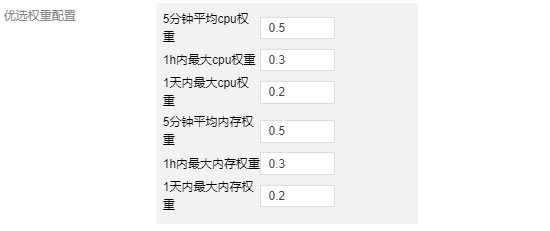

# 问题

在 K8s 集群运营过程中，常常会被节点 CPU 和内存的高使用率所困扰，既影响了节点上 Pod 的稳定运行，也会增加节点故障的几率。为了应对集群节点高负载的问题，平衡各个节点之间的资源使用率，应该基于节点的实际资源利用率监控信息：

>1. 在 Pod 调度阶段，应当优先将 Pod 调度到资源利用率低的节点上运行，不调度到资源利用率已经很高的节点上

<!-- more -->

# 动态调度器

原生的 Kubernetes 调度器有一些很好的调度策略用来应对节点资源分配不均的问题，比如 BalancedResourceAllocation，但是存在一个问题是这样的资源分配是静态的，不能代表资源真实使用情况，节点的 CPU/内存利用率 经常处于不均衡的状态。所以，需要有一种策略可以基于节点的实际资源利用率进行调度。动态调度器所做的就是这样的工作。

## 技术原理

原生 K8s 调度器提供了 scheduler extender 机制来提供调度扩展的能力。相比修改原生 scheduler 代码添加策略，或者实现一个自定义的调度器，使用 scheduler extender 的方式侵入性更少，实现更加灵活。所以我们选择基于 scheduler extender 的方式来添加基于节点的实际资源利用率进行调度的策略。

scheduler extender 可以在原生调度器的预选和优选阶段加入自定义的逻辑，提供和原生调度器内部策略同样的效果。

## 架构

>1. node-annotator：负责拉取 Prometheus 中的监控数据，定期同步到 Node 的 annotation 里面，同时负责其他逻辑，如动态调度器调度有效性衡量指标，防止调度热点等逻辑。
>2. dynamic-scheduler：负责 scheduler extender 的优选和预选接口逻辑实现，在预选阶段过滤掉资源利用率高于阈值的节点，在优选阶段优先选择资源利用率低的节点进行调度。

## 实现细节

1. 动态调度器的策略在优选阶段的权重如何配置？
原生调度器的调度策略在优选阶段有一个权重配置，每个策略的评分乘以权重得到该策略的总得分。对权重越高的策略，符合条件的节点越容易调度上。默认所有策略配置权重为 1，为了提升动态调度器策略的效果，我们把动态调度器优选策略的权重设置为 2。

2. 动态调度器如何防止调度热点？
在集群中，如果出现一个新增的节点，为了防止新增的节点调度上过多的节点，我们会通过监听调度器调度成功事件，获取调度结果，标记每个节点过去一段时间的调度 Pod 数,比如 1min、5min、30min 内的调度 Pod 数量，衡量节点的热点值然后补偿到节点的优选评分中。

## 组件依赖

组件依赖较少，仅依赖基础的节点监控组件 node-exporter 和 Prometheus。
Dynamic Scheduler 动态调度器依赖于 Node 当前和过去一段时间的真实负载情况来进行调度决策，需通过 Prometheus 等监控组件获取系统 Node 真实负载信息。在使用动态调度器之前，需要部署 Prometheus 等监控组件。

## 组件配置

调度策略目前可以基于 CPU 和内存两种资源利用率。

### 预选阶段

配置节点 5分钟内 CPU 利用率、1小时内最大 CPU 利用率，5分钟内平均内存利用率，1小时内最大内存利用率的阈值，超过了就会在预选阶段过滤节点。

### 预选参数
|预选参数默认值|	说明|
|---|---|
|5分钟平均 CPU 利用率阈值|	节点过去5分钟平均 CPU 利用率超过设定阈值，不会调度 Pod 到该节点上。|
|1小时最大 CPU 利用率阈值|	节点过去1小时最大 CPU 利用率超过设定阈值，不会调度 Pod 到该节点上。|
|5分钟平均内存利用率阈值|	节点过去5分钟平均内存利用率超过设定阈值，不会调度 Pod 到该节点上。|
|1小时最大内存利用率阈值|	节点过去1小时最大内存利用率超过设定阈值，不会调度 Pod 到该节点上。|

### 优选阶段

动态调度器优选阶段的评分根据截图中 6个指标综合评分得出，6个指标各自的权重表示优选时更侧重于哪个指标的值，使用 1h 和 1d 内最大利用率的意义是要记录节点 1h 和 1d 内的利用率峰值，因为有的业务 Pod 的峰值周期可能是按照小时或者天，避免调度新的 Pod 时导致在峰值时间节点的负载进一步升高。

### 优选参数

|优选参数默认值|	说明|
|---|---|
|5分钟平均 CPU 利用率权重|	该权重越大，过去5分钟节点平均 CPU 利用率对节点的评分影响越大。|
|1小时最大 CPU 利用率权重|	该权重越大，过去1小时节点最大 CPU 利用率对节点的评分影响越大。|
|1天最大 CPU 利用率权重|	该权重越大，过去1天内节点最大 CPU 利用率对节点的评分影响越大。|
|5分钟平均内存利用率权重|	该权重越大，过去5分钟节点平均内存利用率对节点的评分影响越大。|
|1小时最大内存利用率权重|	该权重越大，过去1小时节点最大内存利用率对节点的评分影响越大。|
|1天最大内存利用率权重|	该权重越大，过去1天内节点最大内存利用率对节点的评分影响越大。|

## 产品效果

为了衡量动态调度器对增强 Pod 调度到低负载节点的提升效果，结合调度器的实际调度结果，获取所有调度到的节点在调度时刻的的 CPU/内存利用率以后统计以下几个指标：

>- cpu_utilization_total_avg ：所有调度到的节点 CPU 利用率平均值。
>- memory_utilization_total_avg ：所有调度到的节点内存利用率平均值。
>- effective_dynamic_schedule_count ：有效调度次数，当调度到节点的 CPU 利用率小于当前所有节点 CPU 利用率的中位数，我们认为这是一次有效调度，effective_dynamic_schedule_count 加 0.5分，对内存也是同理。
>- total_schedule_count ：所有调度次数，每次新的调度累加1。
>- effective_schedule_ratio ：有效调度比率，即 effective_dynamic_schedule_count/total_schedule_count
