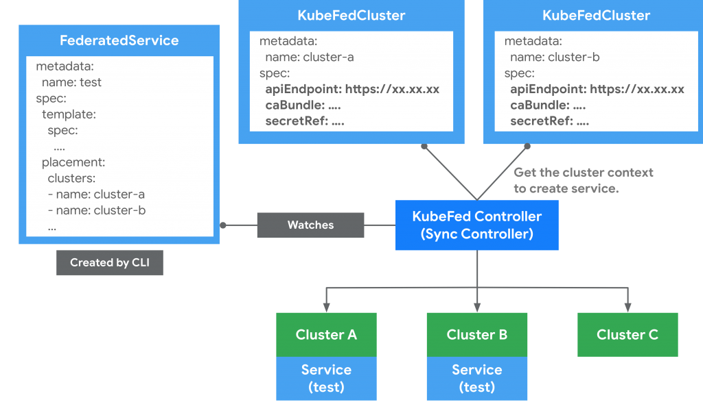
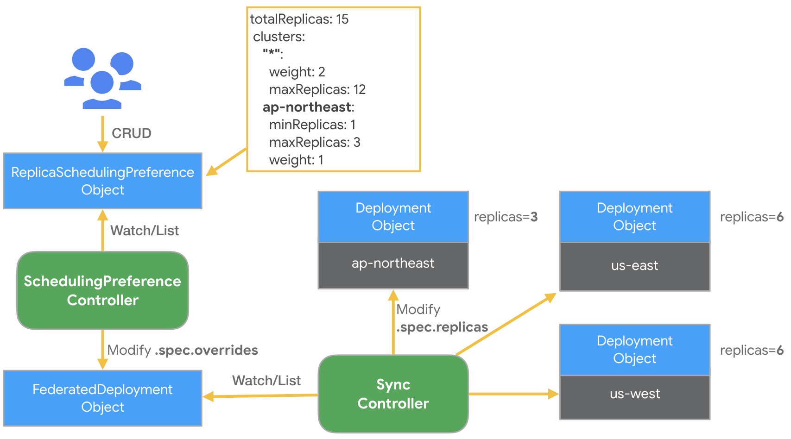
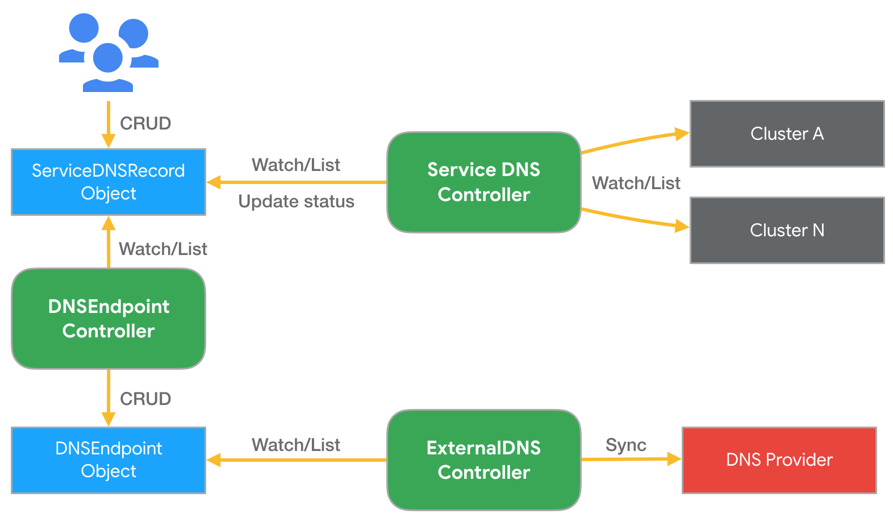

# 介绍

Kubernetes Cluster Federation 又名 KubeFed 或 Federtation v2，是 Kubernetes SIG Multi-Cluster 团队新提出的集群联邦架构。新架构在 Federation v1 基础之上，简化扩展 Federated API过程，并加强跨集群服务发现与编排的功能。

KubeFed 是Kubernetes官方多集群联邦解决方案。它允许用户使用在“Host cluster”中定义的一组简单的APIs，在多个Kubernetes集群中联合统一调度工作负载。

KubeFed 与v1版本使用一套独立的Federation APIs不同，它创建和扩展了一套自定义资源。

在 KubeFed 设计之初，有两个最重要的核心理念是其希望实现的，分别为 Modularization（模块化）和 Customizable（定制化）。这两个理念是希望 KubeFed 能够跟随着 Kubernetes 生态发展，并与之保持相容性和扩展性。

与 v1 版本相比，KubeFed 最大的改变是将 API Server 移除，并通过 CRD 机制来完成 Federated Resources 的扩充，KubeFed Controller 负责管理这些 CRD，并实现同步 Resources 、跨集群编排等功能。
<!-- more -->


# 概念及原理

## Host cluster

用于提供 KubeFed API和控制平面的集群，控制平面中配置了 KubeFedConfig 和 KubeFedCluster 资源，这些资源中配置了该 Host cluster 管理的集群联邦中包含了哪些 member cluster。所有“联邦化”了的资源都会被部署到Host cluster中，并以相同的副本数复制部署到每一个 member cluster 中。控制平面的部署可以使用Helm chart。通过使用命令行工具kubefedctl，可以为联邦添加、删除集群，“联邦化”资源类型。根据 FeatrueGates 的具体配置，KubeFed 控制平面会相应启动多个 controller。

Host cluster 也可以作为 member cluster 加入联邦。

## Member cluster

集群联邦中的成员集群，用来部署“联邦化”的工作负载资源。

通过 KubeFed API 注册的集群，并提供相关身份凭证来让 KubeFed Controller 能够存取集群。

## Template
定义跨级群通用资源的描述信息（representation）

## Placement
定义一个“联邦化”资源应该部署到哪些 member 集群中

## Overrides
定义Template中，单机群的（per-cluster）、字段级别的变量（filed-level）

## Federated Resources
被“联邦化”的资源

## Cluster Configuration
用来定义哪些集群要被联邦。可以使用命令行工具 kubefedctl join/unjoin 来加入/删除集群。当集群成功加入联邦后，会建立一个 KubeFedCluster 组件来存储集群相关信息，如 API Endpoint、CA Bundle等。这些信息 KubeFed Controller 会用来管理 member 集群，以确保能够建立 Kubernetes API 资源

示意图如下所示：



## KubeFed API Group
KubeFed 通过 CRD 方式新增了4种 API 群组来实现联邦机制的核心功能：

|  API Group | 用途|
| ------|------|
|core.kubefed.k8s.io|集群组态、联邦资源组态、KubeFed Controller 设定档等。|
|types.kubefed.k8s.io|被联邦的Kubernetes API 资源。|
|scheduling.kubefed.k8s.io|副本编排策略。|
|multiclusterdns.kubefed.k8s.io|跨集群服务发现设定。|

## Type Configuration
    
用来定义哪些 Kubernetes API 资源要被联邦化。

举个例子，要将 ConfigMap 资源通过联邦机制建立在不同的集群上时，首先要在 Host 集群中通过 CRD 创建新资源 FederatedConfigMap，接着要创建名称为 configmaps 的 Type Configuration（FederatedTypeConfig）资源，描述 ConfigMap 要被 FederatedConfigMap 所管理。这样，KubeFed Controllers 才能知道如何创建 Federated ConfigMap 资源。

下面为范例：
```yaml
apiVersion: core.kubefed.k8s.io/v1beta1
kind: FederatedTypeConfig
metadata:
  name: configmaps
  namespace: kube-federation-system
spec:
  federatedType:
    group: types.kubefed.k8s.io
    kind: FederatedConfigMap
    pluralName: federatedconfigmaps
    scope: Namespaced
    version: v1beta1
  propagation: Enabled
  targetType:
    kind: ConfigMap
    pluralName: configmaps
    scope: Namespaced
    version: v1
```

也可以使用命令行工具新增 CRD 资源，kubefedctl enable <res>，举个例子：
```bash
$ kubefedctl enable etcdclusters
$ kubectl api-resources | grep etcd
etcdclusters                      etcd         etcd.database.coreos.com         true         EtcdCluster
federatedetcdclusters             fetcd        types.kubefed.k8s.io             true         FederatedEtcdCluster
 
$ kubectl -n kube-federation-system get federatedtypeconfigs | grep etcd
etcdclusters.etcd.database.coreos.com    3m16s
```

一个 federated 资源一般具备三个主要功能，这些功能信息能够在 spec 中由使用者自行定义，举个例子：
```yaml
apiVersion: types.kubefed.k8s.io/v1beta1
kind: FederatedDeployment
metadata:
  name: test-deployment
  namespace: test-namespace
spec:
  template: # 定义 Deployment 的所有內容，可理解成 Deployment 与 Pod 之间的关联。
    metadata:
      labels:
        app: nginx
    spec:
      ...
  placement:
    clusters:
    - name: cluster2
    - name: cluster1
  overrides: 
  - clusterName: cluster2
    clusterOverrides:
    - path: spec.replicas
      value: 5
```

>- Template：定义 FederatedDeployment 的所有内容，类似普通 Deployment 的定义，比如 Deployment 与 Pod 之间的关联、副本数等等。
>- Placement：定义联邦化的 Deployment 资源发布到哪些集群中，如果没有定义该部分，则不会发布到任何集群。如果 placement 中定义了多个集群，这些集群中都会创建相同的 Deployment。另外也支持使用 spec.placement.clusterSelector 的方式来选择要放置的集群。
>- Override：用来修改制定集群中 Federated 资源的 spec.template 的内容。如例子 yaml 中使用 override 字段来修改 FederatedDeployment 在集群 cluster2 中的副本数为5。

## Scheduling
KubeFed 提供了一种自动化机制将工作负载实例分散的到不同的集群中，主要是基于资源的总副本数与集群的定义策略来将资源（Deployment或ReplicaSet）进行编排。

编排策略是通过建立 ReplicaSchedulingPreference（RSP）文件，再由 KubeFed RSP Controller 监听和获取 RSP 内容来将工作负载实例创建到指定的集群中。

举个 RSP 的例子，假设有三个集群被联邦管理，名称分别为 ap-northeast、us-east、us-west：
```yaml
apiVersion: scheduling.kubefed.k8s.io/v1alpha1
kind: ReplicaSchedulingPreference
metadata:
  name: test-deployment
  namespace: test-ns
spec:
  targetKind: FederatedDeployment
  totalReplicas: 15 
  clusters: 
    "*":
      weight: 2
      maxReplicas: 12
    ap-northeast:
      minReplicas: 1
      maxReplicas: 3
      weight: 1
```

上面的 yaml 创建后，RSP Controller 监听并获取到资源，并匹配对应 namespace/name 下的 FederatedDeployment 与 FederatedReplicaSet 是否存在。若存在，会根据设定的策略计算出每个集群预期的副本数，之后覆写 Federated 资源中 spec.overrides 的内容以修改每个集群的副本数。最后由 KubeFed Sync Controller 来同步到每个集群的 Deployment。

以上面为例，结果为 ap-northeast 集群会拥有3个 Pod，us-east 和 us-weat 会分别拥有6个 Pod。
```bash
若spec.clusters未定义的话，则预设为{“*”:{Weight: 1}}。

若有定义spec.replicas 的overrides 时，副本会以RSP 为优先考量。

分配的计算机制可以参考kubefed/pkg/controller/util/planner/planner.go。
```


## 创建 Federated 资源
PushReconciler，其作用是自动将“联邦化”资源的变化推送到由 Placement 选择的 member cluster 中。举个例子，如果一个“联邦化”的资源，其在 member cluster 中的实际状态跟联邦资源中的期望状态不同时，比如副本数量因某种原因被删除了一个，pushreconciler会再次同步 member cluster 中该资源的实际状态与期望状态一致。

使用上面提到的 FederatedTypeConfig、KubeFedCluster、KubeFedConfig 三种配置文件，可以将任何类型的 Kubernetes 资源“联邦化”，包括用户自定义资源。

当“联邦化”一种 Kubernetes 资源后，会生成一个 FederatedTypeConfig 配置，该配置说明了 KubeFed 如何处理该种类型的资源。同时还会生成一个CRD，它描述了 Kubernetes API Server应该如何处理这种“联邦化”的资源。

下面看一个“联邦化”的例子，FederatedDeployment：
```yaml
apiVersion: types.kubefed.k8s.io/v1beta1
kind: FederatedDeployment
metadata:
  name: test-deployment
  namespace: test
spec:
  template:
    << DEPLOYMENT SPEC >>
  placement:
    clusters:
    - name: cluster2
    - name: cluster1
    clusterSelector:
      matchLabels:
        region: eu-west-1
  overrides:
  - clusterName: cluster2
    clusterOverrides:
    - path: spec.parallelism
      value: 2
```

在 placement 段中，用户可以显示的以名称的方式制定 member cluster，也可以使用 clusterSelector 通过集群的 lable 指定。

在 overrides 段中，用户可以显示的使用 filed 变量名称，对于更复杂的描述信息可以使用json片段。

“联邦化”的资源是用 namespace 限定的，KubeFed可以配置为全局 scope 或者指定一个 namespace的。KubeFed 控制面会监听所配置的 namespace 中的联邦化资源。

如果设置的 scope 是 global，用户可以在任何 namespace 中创建联邦资源。

## Multi-Cluster DNS（跨集群服务发现）
这个 featrue 生效后，KubeFed 会 watch Service 和 Ingress 资源，将它们注册到外部 DNS服务器。

我们只要创建 Domain 资源，以及一个 ServiceDNSRecord（或者IngressDNSRecord，如果我们有 Ingress 资源的话）。

如下面yaml文件所示，创建 Domain 和 ServiceDNSRecord 资源，将 exampleDomain 和 exampleService 做关联：
```yaml
apiVersion: multiclusterdns.kubefed.k8s.io/v1alpha1
kind: Domain
metadata:
  # Corresponds to <federation> in the resource records.
  name: exampleDomain
  # The namespace running the KubeFed control plane.
  namespace: federation-system
# The domain/subdomain that is set up in your external-dns provider.
domain: example.beta.banzaicloud.io
```
```yaml
apiVersion: multiclusterdns.kubefed.k8s.io/v1alpha1
kind: ServiceDNSRecord
metadata:
  # The name of the sample service.
  name: exampleService
  # The namespace of the sample deployment/service.
  namespace: test
spec:
  # The name of the corresponding `Domain`.
  domainRef: exampleDomain
  recordTTL: 300
```

一旦我们创建以上两种资源，KubeFed 就会创建一个 DNSEndpoint 对象，该对象中存有所有 DNS 名称及其所有 targets 。

首先假设已建立一个名称为nginx的FederatedDeployment，然后放到development namespace中，并且也建立了对应的FederatedService提供LoadBalancer。这时当建立上述Domain与ServiceDNSRecord后，KubeFed的Service DNS Controller会依据ServiceDNSRecord文件内容，去收集不同集群的Service信息，并将这些信息更新至ServiceDNSRecord状态中，接着DNS Endpoint Controller会依据该ServiceDNSRecord的状态内容，建立一个DNSEndpoint文件，并产生DNS records资源，最后再由ExternalDNS Controller来同步更新DNS records至DNS供应商。下图是Service DNS建立的架构。



## 配置信息

KubeFed v2配置信息有两种

>1. FederatedTypeConfig 用来指定哪些API类型 KubeFed 需要处理。
>2. KubeFedCluster 和 KubeFedConfig 都是集群的配置项，用来指定哪些集群加入了 KubeFed 联邦管理。