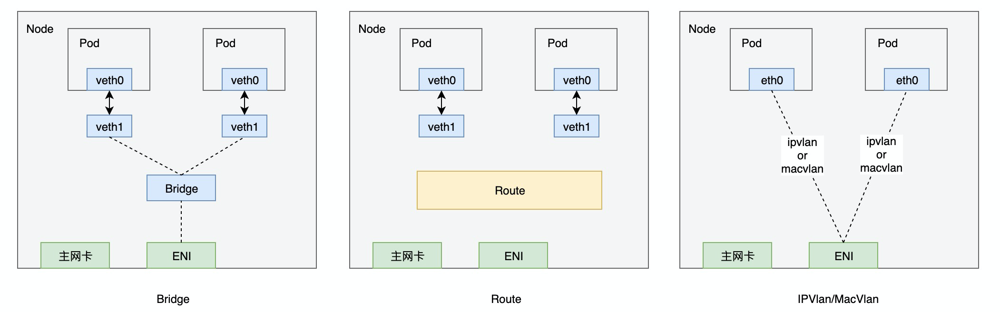

# 方案目的

弹性网卡方案（ENI）性能可以接近vpc原生的网络性能。但是，单台node上pod的数量存在限制；而Multi-ENI方案就是为了解决pod数量限制的问题。

<!-- more -->

# 方案选型

基于ENI多IP构建容器网络一般有bridge, 策略路由, macvlan, ipvlan等多种方案，如下图：

考虑到bridge和策略路由的性能损耗，建议使用IPVlan或MacVlan

# 架构实现

本期仅支持eni，但是会在设计时考虑后期对multi-eni的支持

# 第三方限制

iaas层支持弹性网卡辅助IP管理

- 参考阿里云：https://yq.aliyun.com/articles/699397
- 弹性网卡：分配、添加、删除辅助IP