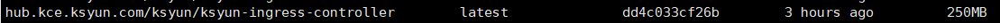
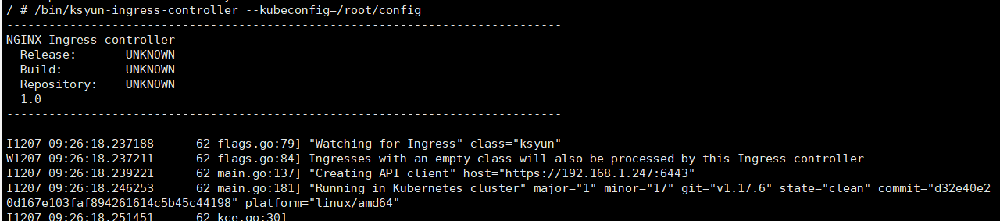
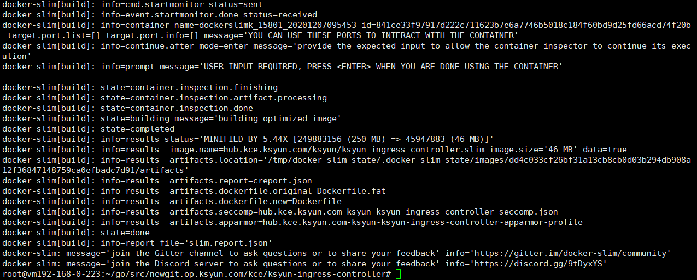
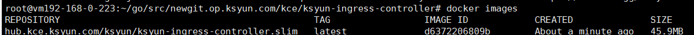

## 前言

当我们在制作docker镜像时，难免会担心镜像的大小，因为，很容易引入一些冗余的信息、文件等。
本文要介绍的就是一种开源的镜像瘦身工具---docker-slim

<!-- more -->

## 工作原理

docker-slim主要是通过以下操作来实现瘦身工作的

>- 检查容器的元数据（静态分析)
>- 检查容器的数据 (静态分析)
>- 检查运行中的应用 (动态分析)
>- 构建应用制品图
>- 通过收集到的应用数据来构建一个小的镜像
>- 通过收集到的应用数据自动生成各种安全框架

其中，静态分析和动态分析包括：

>- 静态分析：主要是获取镜像历史信息，追踪到生成镜像的dockerfile文件，以及设置的port、cmd、enterpoint等数据。
>- 动态分析：主要是通过内核工具ptrace(跟踪系统调用)、pevent(跟踪文件或目录的变化)、fanotify(跟踪进程)解析出镜像中必要的文件和文件依赖，将对应文件组织成新镜像。

***注意：slim会自动完成静态分析，动态分析需要人工配合（人工操作，使得容器内要运行的进程真正的running起来，否则无法追踪程序运行必须的文件和依赖）***

## 安装

下载最新版本
```bash
# wget https://downloads.dockerslim.com/releases/1.32.0/dist_linux.tar.gz
```
解压缩，并将这两个文件拷贝到/usr/bin目录下
```bash
# ls
docker-slim docker-slim-sensor
```

针对某个镜像执行瘦身操作：

```bash
# docker-slim build --http-probe=false image名称:tag
```

操作完成后，会自动生成瘦身后的镜像 image名称.slim:tag

详细操作过程见下一部分的示例

## 示例

原来的镜像：250M


瘦身开始：

```bash
# 执行命令：
# docker-slim build --http-probe=false hub.kce.ksyun.com/ksyun/ksyun-ingress-controller:latest
```


命令会在中止在图中的最下面一行。这句话的意思，就是让用户手动进入一个临时容器内，为进程运行做准备（必须执行，否则获取不到进程所需的文件及其依赖）

在本示例中，程序运行需要挂载主机上的两个文件/目录，并且设置两个环境变量
```bash
# docker cp /opt/app-agent/dockerslimk_15801_20201207095453:/opt/app-agent

# docker cp /root/.kube/config dockerslimk_15801_20201207095453:/root/config
```
然后进入容器
```bash
# docker exec -it dockerslimk_15801_20201207095453 sh
```

设置环境变量
```bash
# export POD_NAME=ksyun-ingress-controller
# export POD_NAMESPACE=kube-system
```
执行程序
```bash
# /bin/ksyun-ingress-controller --kubeconfig=/root/config
```


确保程序正常运行

然后切换到docker-slim build所在的中断，输入“enter”，build结束


瘦身后的镜像

瘦身后是原来的五分之一大小！