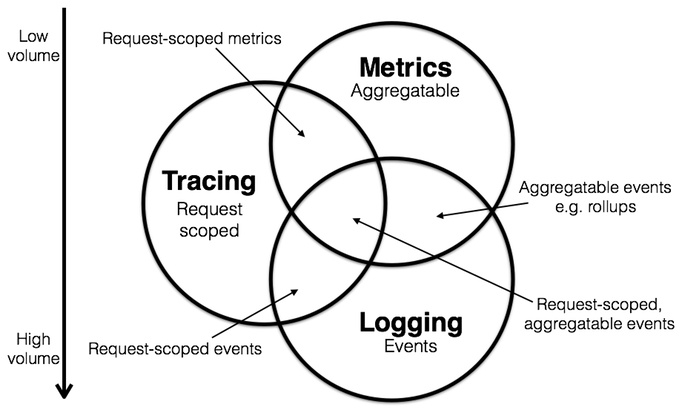
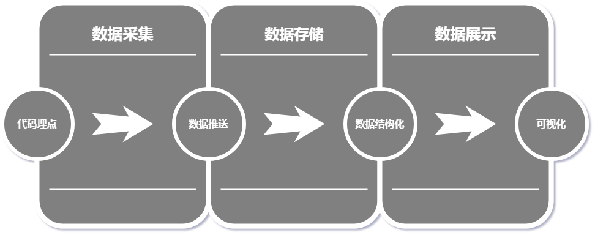
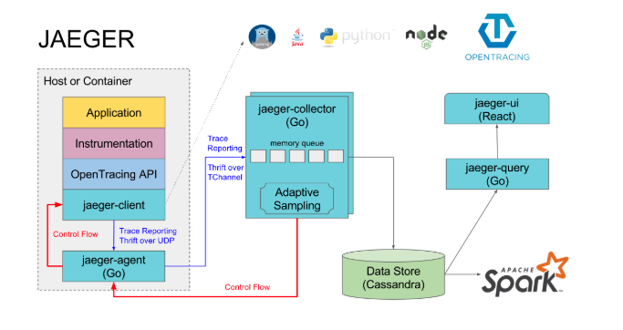

# 开放分布式系统追踪

## 分布式运维系统的挑战

开放和工程团队因为系统组件水平扩展、开放团队小型化、敏捷开放、CD（持续集成）、解耦等各种需求，正在使用现代的微服务架构替换老旧的单机系统。 也就是说，当一个生产系统面对真正的高并发，或者解耦成大量微服务时，以前很容易实现的重点任务变得困难了。过程中需要面临一系列问题：用户体验优化、后台真实错误原因分析，分布式系统内各组件的调用情况等。

<!-- more-->

## 面向DevOps诊断与分析系统



常见诊断与分析系统如：Zipkin，Jaeger(Uber)，Appdash，盘古，云图，X-ray Prometheus，ELK等，可按关注的领域分为三类； Zipkin，Jaeger，Appdash，盘古，云图 ，X-ray专注于tracing，Prometheus专注于metrics，ELK 更专注于logging领域；

## 开放分布式追踪 OpenTracing

### Tracing 与 OpenTracing

分布式追踪系统核心步骤:



当代分布式跟踪系统（例如，Zipkin, Dapper, HTrace, X-Trace等）旨在解决这些问题，但是他们使用不兼容的API来实现各自的应用需求。尽管这些分布式追踪系统有着相似的API语法，但各种语言的开放人员依然很难将他们各自的系统（使用不同的语言和技术）和特定的分布式追踪系统进行整合；为了解决不同的分布式追踪系统 API 不兼容的问题，诞生了OpenTracing标准规范

### OpenTracing概念与术语

|术语|说明|
|---|---|
|Trace|一个trace代表一个潜在的，分布式的，存在并行数据或并行执行轨迹（潜在的分布式、并行）的系统。一个trace可以认为是多个span的有向无环图（DAG）|
|Span|一个span代表系统中具有开始时间和执行时长的逻辑运行单元。span之间通过嵌套或者顺序排列建立逻辑因果关系|
|OperationName|Trace执行操作的名称|
|Inter-Span References|ChildOf 父子关系 ，FollowFrom 引用|
|SpanContext|SpanContext代表跨越进程边界，传递到下级span的状态，并用于封装Baggage|
|Baggage|Baggage是存储在SpanContext中的一个键值对(SpanContext)集合。它会在一条追踪链路上的所有span内全局传输|
|Tag|Span中的键值对，tag不会被子Span集成，也不会传输；span的tag可以用来记录业务相关的数据，并存储于追踪系统中|

```bash
#一个tracer过程中，各span的关系

       [Span A]  ←←←(the root span)
           |
    +------+------+
    |             |
[Span B]      [Span C] ←←←(Span C 是 Span A 的孩子节点, ChildOf)
    |             |
[Span D]      +---+-------+
              |           |
          [Span E]    [Span F] >>> [Span G] >>> [Span H]
                                      ↑
                                      ↑
                                      ↑
                        (Span G 在 Span F 后被调用, FollowsFrom)

```

```bash
# 上述tracer与span的时间轴关系
––|–––––––|–––––––|–––––––|–––––––|–––––––|–––––––|–––––––|–> time
 
 [Span A···················································]
   [Span B··············································]
      [Span D··········································]
    [Span C········································]
         [Span E·······]        [Span F··] [Span G··] [Span H··]
```

# Jaeger(Uber)

Jaeger 是 Uber 推出的一款开源分布式追踪系统，兼容 OpenTracing API，用于分布式微服务系统；

## 主要有以下功能：

- 分布式上下文传递
- 分布式事务流程监控
- 故障分析排查
- 服务依赖分析
- 服务性能优化

## Jaeger组件及架构



>1. jaeger-query    提供trace数据访问接口
>2. jaeger-client   提供不同编程语言对OpenTracing协议的实现，并负责jaerger-agent发送消息	目前支持python，go，java, c++
>3. jaeger-ui	用于trace数据展示	
>4.	jaeger-agent	监听client发送的span消息，并转发给jaeger-collector	每个微服务所在节点，单独部署
>5. jaeger-collector	采集agent发送的trace消息，并对消息进行验证，索引，转化，存储	目前collector支持使用 Cassandra,，Elasticsearch ，Kafka 存储数据