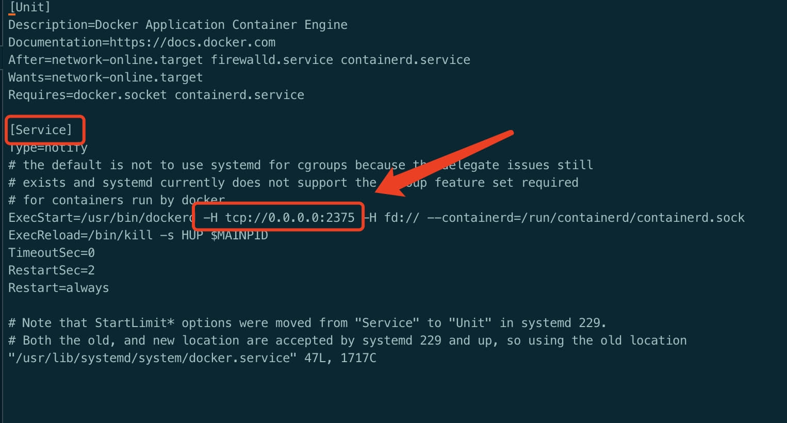

## 背景目的

构建同一个镜像支持amd和arm平台
<!-- more -->

## 方法一

#### 前提条件

    # 设置docker 参数
    export DOCKER_CLI_EXPERIMENTAL=enabled

#### 登入amd机器上编译和制作镜像

    OVN_IMAGE=harbor.yusur.tech/yusur_ovn/ovn-daemonset-f:second-cni-amd64
    # build 镜像
    docker build --build-arg BUILDPLATFORM=linux/amd64 --build-arg TARGETPLATFORM=linux/amd64 -t $OVN_IMAGE -f Dockerfile.fedora .
    # push 镜像
    docker push $OVN_IMAGE

#### 登入arm机器上编译和制作镜像

    OVN_IMAGE=harbor.yusur.tech/yusur_ovn/ovn-daemonset-f:second-cni-aarch64
    # build 镜像
    docker build --build-arg BUILDPLATFORM=linux/aarch64 --build-arg TARGETPLATFORM=linux/aarch64 -t $OVN_IMAGE -f Dockerfile.fedora .
    # push 镜像
    docker push $OVN_IMAGE

#### 创建镜像manifest

    # 创建 manifest 列表
    OVN_IMAGE=harbor.yusur.tech/yusur_ovn/ovn-daemonset-f:second-cni
    OVN_IMAGE_AMD64=harbor.yusur.tech/yusur_ovn/ovn-daemonset-f:second-cni-amd64
    OVN_IMAGE_ARM64=harbor.yusur.tech/yusur_ovn/ovn-daemonset-f:second-cni-aarch64
    # 当要修改一个 manifest 列表时，可以加入 -a 或 --amend 参数
    docker manifest create $OVN_IMAGE $OVN_IMAGE_AMD64 $OVN_IMAGE_ARM64
    # 推送 manifest 列表
    docker manifest push $OVN_IMAGE

#### 设置 manifest 列表

    # 设置 manifest 列表
    OVN_IMAGE=harbor.yusur.tech/yusur_ovn/ovn-daemonset-f:second-cni
    OVN_IMAGE_AMD64=harbor.yusur.tech/yusur_ovn/ovn-daemonset-f:second-cni-amd64
    OVN_IMAGE_ARM64=harbor.yusur.tech/yusur_ovn/ovn-daemonset-f:second-cni-aarch64
    docker manifest annotate $OVN_IMAGE $OVN_IMAGE_AMD64 --os linux --arch x86_64
    docker manifest annotate $OVN_IMAGE $OVN_IMAGE_ARM64 --os linux --arch arm64 --variant v8

#### 查看 manifest 列表

    # 查看 manifest 列表
    OVN_IMAGE=harbor.yusur.tech/yusur_ovn/ovn-daemonset-f:second-cni
    docker manifest inspect $OVN_IMAGE
    # 输出如下信息
    {
       "schemaVersion": 2,
       "mediaType": "application/vnd.docker.distribution.manifest.list.v2+json",
       "manifests": [
          {
             "mediaType": "application/vnd.docker.distribution.manifest.v2+json",
             "size": 4902,
             "digest": "sha256:8ed550698e5dabaee8dbafaf9a4c41f7173fe2aaf17437cd7fc4a8b163983e31",
             "platform": {
                "architecture": "arm64",
                "os": "linux"
             }
          },
          {
             "mediaType": "application/vnd.docker.distribution.manifest.v2+json",
             "size": 4899,
             "digest": "sha256:4c59e7cb42177d9a7aadc476dbf5bf88448bd3097ad763f8ff70753934ec3b16",
             "platform": {
                "architecture": "amd64",
                "os": "linux"
             }
          }
       ]
    }

## 方法二

_**使用amd架构的docker和arm架构的docker 两种docker 整合成一个docker编译平台**_

#### docker远程

编辑 /usr/lib/systemd/system/docker.service文件

在如下位置添加 \-H tcp:_//0.0.0.0:2375_

重启docker

    systemctl daemon-reload
    systemctl restart docker

测试连接

    curl http://localhost:2375/version

使用 docker buildx 构建跨平台 容器镜像。

默认的 docker build 命令无法完成跨平台构建任务，我们需要为 docker 命令行安装 buildx 插件扩展其功能。buildx 能够使用由 [Moby BuildKit](https://github.com/moby/buildkit) 提供的构建镜像额外特性，它能够创建多个 builder 实例，在多个节点并行地执行构建任务，以及跨平台构建。

#### buildx启用

macOS 或 Windows 系统的 Docker Desktop，以及 Linux 发行版通过 deb 或者 rpm 包所安装的 docker 内置了 buildx，不需要另行安装。

如果 docker 没有 buildx 命令，可以下载二进制包进行安装：

1.  首先从 [Docker buildx](https://github.com/docker/buildx/releases/latest) 项目的 release 页面找到适合自己平台的二进制文件。
    
2.  下载二进制文件到本地并重命名为 docker-buildx，移动到 docker 的插件目录 ~/.docker/cli-plugins 或者 /usr/libexec/docker/cli-plugins 目录。
    
3.  向二进制文件授予可执行权限。
    

如果本地的 docker 版本高于 19.03，可以通过以下命令直接在本地构建并安装，这种方式更为方便：

    DOCKER_BUILDKIT=1 docker build --platform=local -o . "https://github.com/docker/buildx.git"
    mkdir -p ~/.docker/cli-plugins
    mv buildx ~/.docker/cli-plugins/docker-buildx

使用 buildx 进行构建的方法如下：

    # docker 20.X 以下版本需要开启环境变量
    export DOCKER_CLI_EXPERIMENTAL=enabled
    
    # 查看docker 是否支持buildx
    docker info | grep buildx
      buildx: Docker Buildx (Docker Inc., v0.10.4)
    
    # buildx 进行构建的方法
    cdocker buildx build .

buildx 和 docker build 命令的使用体验基本一致，还支持 build 常用的选项如 \-t、\-f等。

#### buildx实例

docker buildx 通过 builder 实例对象来管理构建配置和节点，命令行将构建任务发送至 builder 实例，再由 builder 指派给符合条件的节点执行。我们可以基于同一个 docker 服务程序创建多个 builder 实例，提供给不同的项目使用以隔离各个项目的配置，也可以为一组远程 docker 节点创建一个 builder 实例组成构建阵列，并在不同阵列之间快速切换。

使用 docker buildx create 命令可以创建 builder 实例，这将以当前使用的 docker 服务为节点创建一个新的 builder 实例。要使用一个远程节点，可以在创建示例时通过 DOCKER\_HOST 环境变量指定远程端口或提前切换到远程节点的 docker context。

下面首先以当前节点创建一个新的 builder 实例，并通过命令行选项指定实例名称、驱动以及当前节点的目标平台：

    # docker 20.X 以下版本需要开启环境变量
    export DOCKER_CLI_EXPERIMENTAL=enabled
    
    # 创建新builder 实例 multi-builder
    docker buildx create --driver docker-container --platform linux/amd64 --name multi-builder
    multi-builder
    
    # 添加远程arm平台的buidler
    export DOCKER_HOST=tcp://192.168.100.2:2375 #(前提：远程docker开启远程访问)
    docker buildx create --name multi-builder --append --node remote-builder
    
    #启动新buidler实例 multi-builder
    [root@yusur-53 test]#docker buildx inspect --bootstrap multi-builder
    Name:          multi-builder
    Driver:        docker-container
    Last Activity: 2023-04-14 09:59:15 +0000 UTC
    
    Nodes:
    Name:      multi-builder0
    Endpoint:  unix:///var/run/docker.sock
    Status:    running
    Buildkit:  v0.9.3
    Platforms: linux/amd64, linux/386
    
    Name:      remote-builder
    Endpoint:  tcp://192.168.100.2:2375
    Status:    running
    Buildkit:  v0.11.5
    Platforms: linux/arm64, linux/arm/v7, linux/arm/v6

    # 查看现有builder所有实例
    [root@yusur-53 test]#docker buildx ls
    NAME/NODE        DRIVER/ENDPOINT             STATUS  BUILDKIT PLATFORMS
    multi-builder *  docker-container                             
      multi-builder0 unix:///var/run/docker.sock running v0.9.3   linux/amd64, linux/386
      remote-builder tcp://192.168.100.2:2375    running v0.11.5  linux/arm64, linux/arm/v7, linux/arm/v6
    default          docker                                       
      default        default                     running 20.10.12 linux/arm64, linux/arm/v7, linux/arm/v6

启用新builder 实例

    # 启用后才能使用 multi-builder 多架构编译镜像
    docker buildx use multi-builder

#### buildx构建

构建单个arm镜像

    # 构建arm的镜像到本地
    OVN_IMAGE=harbor.yusur.tech/yusur_ovn/ovn-daemonset-f:second-cni-aarch64
    docker buildx build --build-arg BUILDPLATFORM=linux/aarch64 --build-arg TARGETPLATFORM=linux/aarch64  --platform=linux/arm64 -t $OVN_IMAGE -o type=docker -f Dockerfile.fedora .

构建单个amd镜像

    # 构建amd的镜像到本地
    OVN_IMAGE=harbor.yusur.tech/yusur_ovn/ovn-daemonset-f:second-cni-amd64
    docker buildx build --build-arg BUILDPLATFORM=linux/amd64 --build-arg TARGETPLATFORM=linux/amd64  --platform=linux/amd64 -t $OVN_IMAGE -o type=docker -f Dockerfile.fedora .

构建多种arm, amd镜像

    #编译完成后就直接push到hub
    OVN_IMAGE=harbor.yusur.tech/yusur_ovn/ovn-daemonset-f:second-cni
    docker buildx build --push --platform linux/arm64,linux/amd64 -t $OVN_IMAGE -f Dockerfile.fedora .

#### go代码例子

    cat <<EOF > demo.go
    package main
    
    import (
    	"fmt"
    	"log"
    	"net/http"
    )
    
    func listenServer() {
    	http.Handle("/", http.HandlerFunc(lServe))
    	http.ListenAndServe(":8080", nil)
    }
    
    func lServe(w http.ResponseWriter, r *http.Request) {
    	log.Println("response success")
    	fmt.Fprintln(w, "hello world")
    }
    func main() {
    	listenServer()
    }
    EOF
    
    # 编写Dockerfile
    cat <<EOF > Dockerfile
    # Build the manager binary
    FROM golang:1.19 as builder
    MAINTAINER leid
    WORKDIR /workspace
    ADD . ./
    ENV GO111MODULE=on
    ENV GOPROXY="https://goproxy.io"
    RUN go build -o demo demo.go
    FROM alpine:latest
    WORKDIR /
    COPY --from=builder /workspace/demo .
    EXPOSE 8080
    ENTRYPOINT ["/demo"]
    EOF

编译该代码

    # 编译镜像
    docker buildx build --push --platform linux/arm64,linux/amd64 -t harbor.yusur.tech/leid/demo:latest .
    
    # 查看镜像digests
    docker buildx imagetools inspect harbor.yusur.tech/leid/demo:latest
    
    Name:      docker.io/flftuu/demo:latest
    MediaType: application/vnd.docker.distribution.manifest.list.v2+json
    Digest:    sha256:d2bfa8696da0f3e8e4bfe8d4f1b23c1e10dbb7e1dbea7dcfa59a851ae7a8fb8c
               
    Manifests: 
      Name:      docker.io/flftuu/demo:latest@sha256:58c51a62aa94b9d138d39fdb79759d41a7b04f8c4d8c4901ebbf7ed16363e6a2
      MediaType: application/vnd.docker.distribution.manifest.v2+json
      Platform:  linux/arm64
                 
      Name:      docker.io/flftuu/demo:latest@sha256:00ec9b7455915a9b70c9ffa316326147c1a2225b5bd014367a4cdf97984f0916
      MediaType: application/vnd.docker.distribution.manifest.v2+json
      Platform:  linux/amd64

## 方法三

#### binfmt\_misc启用

如果你使用的是 Docker 桌面版（MacOS 和 Windows），默认已经启用了 binfmt\_misc，可以跳过这一步。

如果你使用的是 Linux，需要手动启用 binfmt\_misc。大多数 Linux 发行版都很容易启用，不过还有一个更容易的办法，直接运行一个特权容器，容器里面写好了设置脚本：

    $ docker run --rm --privileged docker/binfmt:a7996909642ee92942dcd6cff44b9b95f08dad64

验证是 binfmt\_misc 否开启：

    [root@centos8~]$ ls -al /proc/sys/fs/binfmt_misc/  
    total 0
    drwxr-xr-x 2 root root 0 Jun 16 18:46 .
    dr-xr-xr-x 1 root root 0 Jun  5 21:42 ..
    -rw-r--r-- 1 root root 0 Jun 16 19:22 qemu-aarch64
    -rw-r--r-- 1 root root 0 Jun 16 19:22 qemu-arm
    -rw-r--r-- 1 root root 0 Jun 16 19:22 qemu-ppc64le
    -rw-r--r-- 1 root root 0 Jun 16 19:22 qemu-riscv64
    -rw-r--r-- 1 root root 0 Jun 16 19:22 qemu-s390x
    --w------- 1 root root 0 Jun 16 18:46 register
    -rw-r--r-- 1 root root 0 Jun 16 18:46 status

验证是否启用了相应的处理器：

    [root@centos8 ~]$ cat /proc/sys/fs/binfmt_misc/qemu-aarch64  
    enabled
    interpreter /usr/bin/qemu-aarch64
    flags: OCF
    offset 0
    magic 7f454c460201010000000000000000000200b7
    mask ffffffffffffff00fffffffffffffffffeffff

**注意**

请将 Linux 内核版本升级到 4.x 以上，特别是 CentOS7 用户。

centos7 用户可以用以下命令开启

    $ docker run --rm --privileged multiarch/qemu-user-static:register --reset
    
    $ cat /proc/sys/fs/binfmt_misc/qemu-aarch64
    enabled
    interpreter /usr/bin/qemu-aarch64-static
    flags: 
    offset 0
    magic 7f454c460201010000000000000000000200b700
    mask ffffffffffffff00fffffffffffffffffeffffff
    
    $ docker create -it --name dummy multiarch/qemu-user-static:x86_64-aarch64 bash
    
    $ docker container ls -a
    CONTAINER ID        IMAGE                                       COMMAND             CREATED             STATUS              PORTS               NAMES
    6ab622a76dfa        multiarch/qemu-user-static:x86_64-aarch64   "bash"              3 minutes ago       Created                                 dummy
    
    $ docker cp dummy:/usr/bin/qemu-aarch64-static qemu-aarch64-static
    
    $ ls qemu-aarch64-static
    qemu-aarch64-static*
    
    $ docker rm -f dummy
    
    $ docker container ls -a
    CONTAINER ID        IMAGE               COMMAND             CREATED             STATUS              PORTS               NAMES
    
    $ docker run --rm -t -v $(pwd)/qemu-aarch64-static:/usr/bin/qemu-aarch64-static arm64v8/ubuntu uname -m
    aarch64docker run --rm --privileged multiarch/qemu-user-static:register --reset

#### 切换多平台构建器

由于 Docker 默认的 builder 实例不支持同时指定多个 \--platform，我们必须首先创建一个新的 builder 实例手动替换

    docker buildx create --use --name multi-builder

启动构建器：

    root@master01:/tmp# docker buildx inspect multi-builder --bootstrap
    [+] Building 2.7s (1/1) FINISHED                                                                                                                                      
     => [internal] booting buildkit                                                                                                                                  2.7s
     => => pulling image moby/buildkit:buildx-stable-1                                                                                                               2.3s
     => => creating container buildx_buildkit_multi-builder0                                                                                                         0.4s
    Name:          multi-builder
    Driver:        docker-container
    Last Activity: 2023-04-17 03:08:42 +0000 UTC
    
    Nodes:
    Name:      multi-builder0
    Endpoint:  unix:///var/run/docker.sock
    Status:    running
    Buildkit:  v0.11.5
    Platforms: linux/amd64, linux/amd64/v2, linux/amd64/v3, linux/arm64, linux/riscv64, linux/ppc64le, linux/s390x, linux/386, linux/arm/v7, linux/arm/v6

查看当前使用的构建器及构建器支持的 CPU 架构，可以看到支持很多 CPU 架构：

    root@master01:/tmp# docker buildx ls
    NAME/NODE        DRIVER/ENDPOINT             STATUS  BUILDKIT PLATFORMS
    multi-builder *  docker-container                             
      multi-builder0 unix:///var/run/docker.sock running v0.11.5  linux/amd64, linux/amd64/v2, linux/amd64/v3, linux/arm64, linux/riscv64, linux/ppc64le, linux/s390x, linux/386, linux/arm/v7, linux/arm/v6
    default          docker                                       
      default        default                     running 23.0.3   linux/amd64, linux/amd64/v2, linux/amd64/v3, linux/386, linux/arm64, linux/riscv64, linux/ppc64le, linux/s390x, linux/arm/v7, linux/arm/v6

#### 构建多平台镜像

新建 Dockerfile 文件,将该应用容器化

    FROM --platform=$TARGETPLATFORM alpine
    
    RUN uname -a > /os.txt
    
    CMD cat /os.txt

现在就可以使用 buildx 构建一个支持 arm、arm64 和 amd64 多架构的 Docker 镜像了，同时将其推送到 [Docker Hub](https://hub.docker.com/)：

\--push 参数表示将构建好的镜像推送到 Docker 仓库。

提前使用docker login 命令登录认证 Docker Hub

    docker buildx build --platform linux/arm,linux/arm64,linux/amd64 -t flftuu/demo . --push
    
    # 查看镜像信息
    docker buildx imagetools inspect flftuu/demo

背后的原理也很简单，之前已经提到过了，buildx 会通过

QEMU 和 binfmt\_misc 分别为 3 个不同的 CPU 架构（arm，arm64 和 amd64）构建 3 个不同的镜像。构建完成后，就会创建一个 [manifest list](https://docs.docker.com/engine/reference/commandline/manifest/)，其中包含了指向这 3 个镜像的指针。

如果想将构建好的镜像保存在本地，可以将

type 指定为 docker，但必须分别为不同的 CPU 架构构建不同的镜像，不能合并成一个镜像，即：

    docker buildx build -t hello-arch:arm --platform=linux/arm -o type=docker .
    docker buildx build -t hello-arch:arm64 --platform=linux/arm64 -o type=docker .
    docker buildx build -t hello-arch:amd64 --platform=linux/amd64 -o type=docker .

#### 测试多平台镜像

由于之前已经启用了 binfmt\_misc，现在我们就可以运行任何 CPU 架构的 Docker 镜像了，因此可以在本地系统上测试之前生成的 3 个镜像是否有问题。

    # arm
    $ docker run -it --rm hello-arch:arm
    Linux buildkitsandbox 4.18.0-80.el8.x86_64 #1 SMP Tue Jun 4 09:19:46 UTC 2019 armv7l Linux
    
    # arm64
    $ docker run -it --rm hello-arch:arm64
    Linux buildkitsandbox 4.18.0-80.el8.x86_64 #1 SMP Tue Jun 4 09:19:46 UTC 2019 aarch64 Linux
    
    # amd64
    $ docker run -it --rm hello-arch:amd64 
    Linux buildkitsandbox 4.18.0-80.el8.x86_64 #1 SMP Tue Jun 4 09:19:46 UTC 2019 x86_64 Linux
