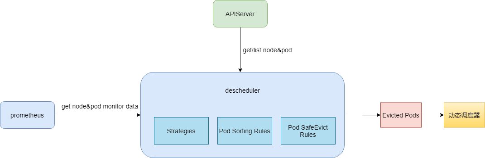
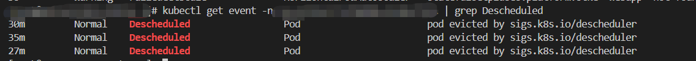
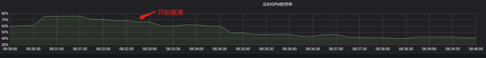

## 简介

DeScheduler 是容器服务的一个基于 Node 真实负载进行重调度的插件。该插件会和 Kube-scheduler 协同生效，实时监控集群中高负载节点并驱逐低优先级 Pod。建议您搭配 Dynamic Scheduler（动态调度器扩展组件）一起使用，多维度保障集群负载均衡。
该插件依赖 Prometheus 监控组件以及相关规则配置。

<!-- more -->

## 使用场景
DeScheduler 通过重调度来解决集群现有节点上不合理的运行方式。社区版本 DeScheduler 中提出的策略基于 APIServer 中的数据实现，并未基于节点真实负载。因此可以增加对于节点的监控，基于真实负载进行重调度调整。

容器服务 TKE 自研的 ReduceHighLoadNode 策略依赖 Prometheus 和 node_exporter 监控数据，根据节点 CPU 利用率、内存利用率、网络 IO、system loadavg 等指标进行 Pod 驱逐重调度，防止出现节点极端负载的情况。DeScheduler 的 ReduceHighLoadNode 与 TKE 自研的 Dynamic Scheduler 基于节点真实负载进行调度的策略需配合使用。

## Descheduler

现有的集群调度场景都是一次性调度，即一锤子买卖。后续出现节点 CPU 和内存利用率过高，也无法自动调整 Pod 的分布，除非触发节点的 eviction manager 后驱逐，或者人工干预。这样在节点 CPU/内存利用率高时，影响了节点上所有 Pod 的稳定性，而且负载低的节点资源还被浪费。

针对此场景，借鉴 K8s 社区 Descheduler 重调度的设计思想，给出基于各节点 CPU/内存实际利用率进行驱逐的策略。

## 架构

Descheduler 从 apiserver 中获取 Node 和 Pod 信息，从 Prometheus 中获取 Node 和 Pod 监控信息，然后经过Descheduler 的驱逐策略，驱逐 CPU/内存使用率高的节点上的 Pod ，同时我们加强了 Descheduler 驱逐 Pod 时的排序规则和检查规则，确保驱逐 Pod 时服务不会出现故障。驱逐后的 Pod 经过动态调度器的调度会被调度到低水位的节点上，实现降低高水位节点故障率，提升整体资源利用率的目的。

## 产品依赖

依赖基础的节点监控组件 node-exporter 和Prometheus。

## 产品效果

### 通过 K8s 事件
通过 K8s 事件可以看到 Pod 被重调度的信息，所以可以开启集群事件持久化功能来查看 Pod 驱逐历史。

### 节点负载变化

在类似如下节点 CPU 使用率监控视图内，可以看到在开始驱逐之后，节点的 CPU 利用率下降。

