# Dragonfly

## 简介
Dragonfly是一个基于P2P的智能文件分发系统,用于解决大规模文件分发场景下分发耗时、成功率低、带宽浪费等难题。大幅提升发布部署、数据预热、大规模容器镜像分发等业务能力。
<!-- more -->

### 架构

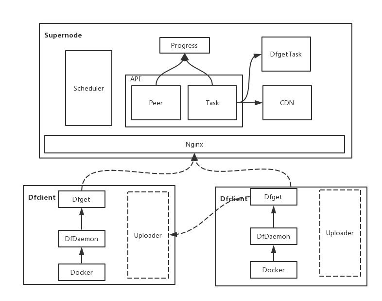

>- SuperNode：Dragonfly的服务端，它主要负责种子块的生命周期管理以及构造 P2P 网络并调度客户端互传指定分块。
>- Dfclient：Dragonfly的客户端，安装在每台主机上，主要负责分块的上传与下载以及与容器 Daemon 的命令交互。Host上发起的docker命令会被dfGet proxy截获。
当通过Dragonfly下载某层镜像文件时，蜻蜓的SuperNode会把整个文件拆分成一个个的块，SuperNode 中的分块称为种子块，种子块由若干初始客户端下载并迅速在所有客户端之间传播，其中分块大小通过动态计算而来。

### 优势

>- 使用p2p方式分发文件。充分利用peer之间的网络带宽，提高下载效率，减少跨区域网络压力。
>- 无缝集成docker，可以用来进行镜像分发。
>- 主机层的限速。不需要对每次下载进行限速设置（对比scp、wget等）。
>- （被动模式的）CDN。提供CDN机制，避免重复远程下载。
>- Strong consistency
>- Disk protection and highly efficient IO
>- High performance
>- Auto-isolation of Exception
>- 减轻对文件服务器压力。只有supernode节点需要从文件服务器下载。
>- Support standard HTTP header
>- Effective concurrency control of Registry Auth
>- Simple and easy to use

## 工作原理

[原理](https://github.com/dragonflyoss/Dragonfly/blob/master/docs/design/design.md)

### 下载流程
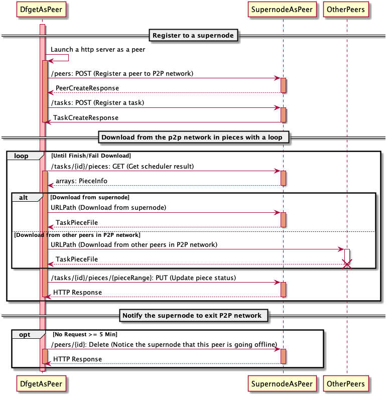

### 注册阶段
>1. dfget需要把自己注册为p2p网络的一个peer。
>2. dfget从supernode获取待下载文件对应的taskId。dragonfly中一个文件由taskId唯一标记，supernode检查待下载的文件是否存在，如果文件不存在的话，supernode会异步下载文件。下载完成后更新==bitmap信息==。

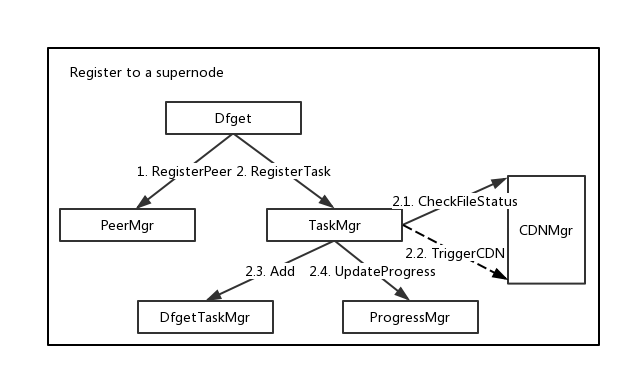

### 下载阶段
文件被拆成piece分片下载。

>1. 获取拥有待下载piece的peer节点信息
>2. 从指定peer下载piece
>3. 告诉supernode自己具备piece可供其他peer下载

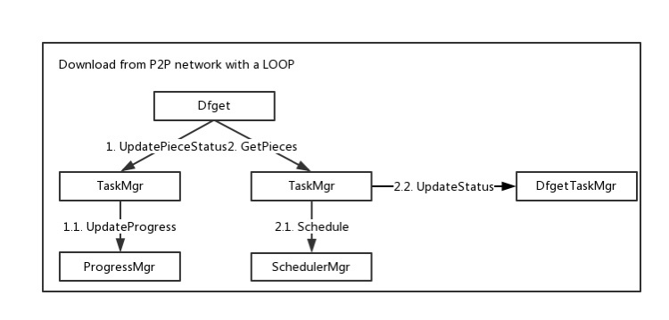

文件按分块进行下载。dfget A从supernode获取block 1，dfget C从dfget A获取block 1，dfget B从dfget C获取block 1。

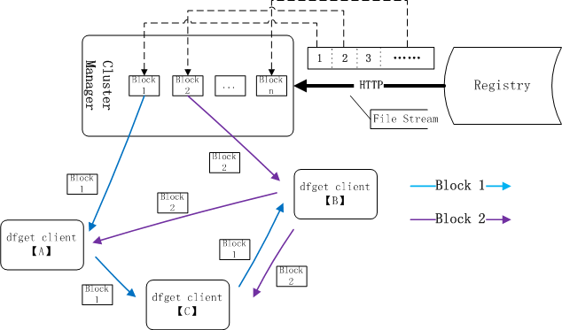

### 退出阶段
没有上传下载任务（5min期限）时，从p2p网推出
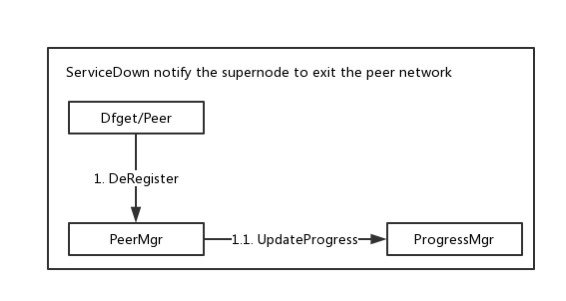

## 充当docker的HTTP代理

https://github.com/dragonflyoss/Dragonfly/blob/master/docs/user_guide/container_runtimes/docker_proxy.md

docker提供了registry-mirrors参数，用来配置仓库的镜像代理，对目标仓库的请求会由代理进行处理。但目前目标仓库只能是官网hub，还不支持为用户的私有仓库配置代理服务器，不过可以通过配置docker的HTTP代理的方式实现这个目标。

可以使用dfdaemon作为docker的HTTP代理，具体配置方法如下。

### 配置dfdaemon
```yaml
# 代理对镜像layer的请求
proxies:
- regx: blobs/sha256.*
 
# 默认只代理HTTP类型的请求，下面的配置可以开启对HTTPS请求的代理
hijack_https:
  cert: df.crt
  key: df.key
  hosts:
  - regx: your.private.registry
    # 私有仓库有自签名证书时，避免证书错误
    insecure: true
    # 私有仓库有自签名证书时，也可以指定证书文件
    # certs: ["server.crt"]
```

满足 proxies 规则的请求会交由dfget处理，其他请求走直接代理方式。

hijack_https表示，会对匹配hosts规则的HTTPS请求进行代理。==df.key和df.crt的作用==

server.crt是目标仓库的证书文件，如果手头没有该证书文件，可以通过以下命令行获取。
```bash
openssl x509 -in <(openssl s_client -showcerts -servername hub..docker.com -connect hub.docker.com:443 -prexit 2>/dev/null)
```
代理配置的进一步说明，请参考 https://github.com/dragonflyoss/Dragonfly/blob/master/docs/user_guide/proxy.md 。

### 为docker设置代理

设置docker的HTTP代理环境变量，并重启docker服务。
```bash
mkdir -p /etc/systemd/system/docker.service.d
 
cat << EOF > /etc/systemd/system/docker.service.d/http-proxy.conf
[Service]
Environment="HTTP_PROXY=http://127.0.0.1:65001"
Environment="HTTPS_PROXY=http://127.0.0.1:65001"
EOF
 
systemctl daemon-reload && systemctl restart docker.service
```

# Harbor集成Dragonfly下载镜像
https://github.com/dragonflyoss/Dragonfly/blob/master/docs/ecosystem/Harbor-with-Dragonfly.md

## 试验环境

### 拓扑结构

3节点，1个supernode，2个dfclient
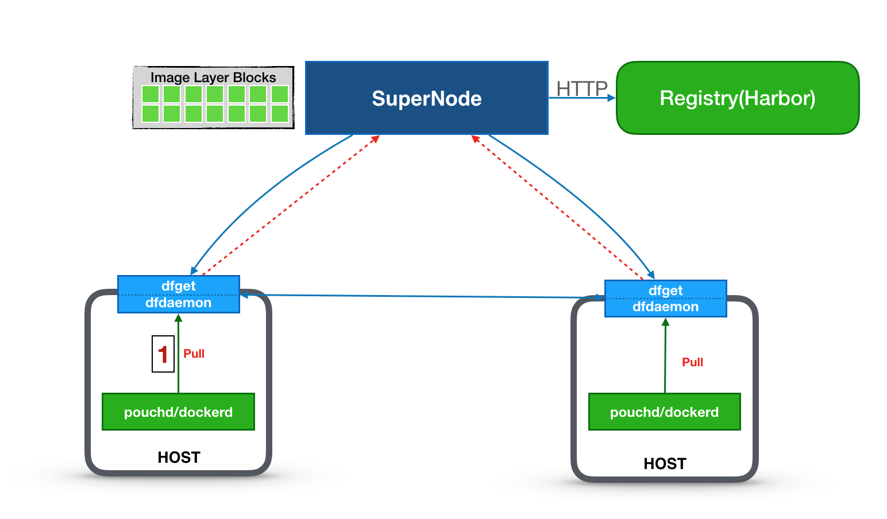

### 组件交互关系

docker pull启动拉取镜像过程

dfdaemon作为代理，请求harbor下载镜像

dfdaemon把下载镜像blob请求交给dfget处理，dfget作为peer客户端从p2p网络下载数据

supernode从s3下载blob数据，并缓存到本地

==不满足规则匹配请求，直接访问s3==

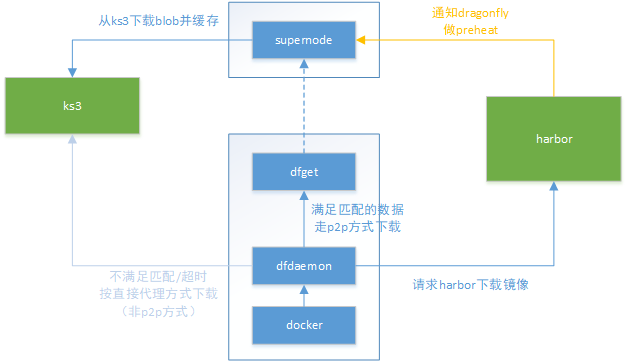

## 部署过程

### 部署supernode
github上提供了supernode配置文件模板，[地址](https://github.com/dragonflyoss/Dragonfly/blob/master/docs/config/supernode_config_template.yml)

启动服务

```bash
# 挂载本地/data/supernode到容器，其中保存有log信息
# 添加了测试仓库服务器的域名解析，预热下载镜像时需要访问harbor
docker run -d --name supernode --restart=always -p 8001:8001 -p 8002:8002 \
    -v /data/supernode:/home/admin/supernode \
    --add-host=hub-p2p-test.docker.com:10.0.0.77 \
    hub.docker.com/docker/dragonflyoss/supernode:1.0.6
```

### 配置集群节点

#### 以ds方式部署dfclient
生成df.key和df.crt

```bash
openssl genrsa -des3 -passout pass:x -out df.pass.key 2048 openssl rsa -passin pass:x -in df.pass.key -out df.key
rm df.pass.key
openssl req -new -key df.key -out df.csr
openssl x509 -req -sha256 -days 365 -in df.csr -signkey df.key -out df.crt
rm df.csr
```

dfdaemon.yml
```yaml
# config the dfget flags according to your own needs, please refer to https://github.com/dragonflyoss/Dragonfly/blob/master/docs/cli_reference/dfget.md
dfget_flags: ["--node","10.0.0.10=1","-f","Expires&Signature"]
proxies:
  # proxy all http image layer download requests with dfget
  - regx: blobs/sha256.*
hijack_https:
  # key pair is used to hijack https requests between the caller(E.g. dockerd, containerd) and dfdaemon. You can generate them with make df.crt at the root directory of dragonfly project.
  cert: /etc/dragonfly/df.crt
  key: /etc/dragonfly/df.key
  hosts:
    - regx: hub-p2p-test.docker.com:32443
      # If your registry uses a self-signed certificate, please provide the certificate
      # or choose to ignore the certificate error with `insecure: true`.
      # certs: ["/etc/dragonfly/ca.crt"]
```

使用docker启动容器

```bash
# 当前目录存放了配置文件和key
# 添加了测试仓库服务器的域名解析
docker run -d --name dfclient --restart=always -p 65001:65001 \
   -v ${PWD}/:/etc/dragonfly \
   -v $HOME/.small-dragonfly:/root/.small-dragonfly \
   --add-host=hub-p2p-test.docker.com:10.0.0.77 \
   hub.docker.com/docker/dragonflyoss/dfclient:1.0.6
```
#### 修改docker配置
配置dfclient作为docker的HTTP/HTTPS代理，见上一章节

### 下载测试

通过下面的查询，可以确认从其他peer下载了piece

```bash
grep 'downloading piece' /root/.small-dragonfly/logs/dfclient.log | grep -v cdnnode
```
dfdaemon拦截下载blob请求，调用dfget下载命令。

```bash
/opt/dragonfly/df-client/dfget \
   -u "http://docker-registry-test-sh2.s3-internaldocker.com/test-210/docker/registry/v2/blobs/sha256/57/57375f954af97454264f890a460ba86b87992a5b50c1442b5c532ed5c8bb632f/data?Expires=1604406484&KSSAccessKeyId=bzMoctdKv0tXPJMHOkdn&Signature=LNvgD8CLY6gxEn5NyduM1iWHi78%3D" \
   -o /root/.small-dragonfly/dfdaemon/data/f1328689-3208-4c83-a577-4442d44484f9 \
   --node 10.0.0.10=1 \
   -f "Expires&Signature" \
   --dfdaemon \
   -s 20MB \
   --totallimit 20MB \
   --header "User-Agent:docker/18.09.2 go/go1.10.6 git-commit/6247962 kernel/4.14.0-49.2.2.el7.docker.x86_64 os/linux arch/amd64 UpstreamClient(Docker-Client/18.09.4 \(linux\))" \
   --header Connection:close
```
使用iftop查看网络流量

# Harbor使用Dragonfly进行镜像预热/预分发

## 功能介绍

preheat，和p2p功能下载耦合小，仅仅是对p2p下载功能的补充

支持Dragonfly（1.0.5+）和Kraken（0.1.3+）

dragonfly的supernode节点，把普通的p2p下载文件缓存在/data/supernode/repo/download/目录，会被定期GC，而preheat的文件会缓存在/data/supernode/repo/preheat/目录，这些文件不会被GC掉

系统管理员创建preheat provider实例。需要指定vendor的端口和必要的认证信息，一个provider实例可以被仓库的所有项目共用。

项目管理员创建预热规则。预热规则是项目级别的，包括镜像过滤规则、provider实例、启动方式（手动、定时、基于事件）。一个项目可以设置多个预热规则。

预热执行后的结果是，满足条件的镜像分发到P2P引擎（dragonfly的supernode）上。

harbor保存预热历史记录和日志，便于回溯。

## 使用方法

### 配置分布式分发实例

端点地址指向supernode的8002端口，该实例可以被所有项目使用。

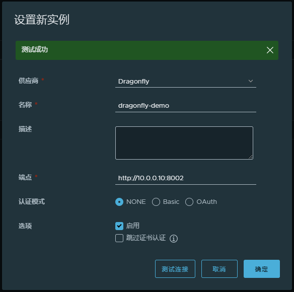

配置项目的预热规则
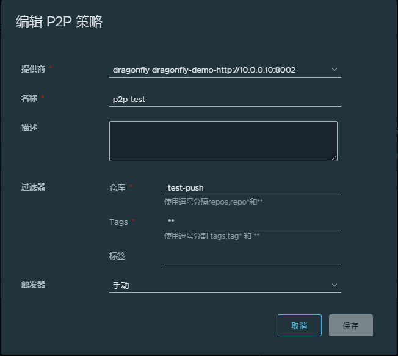

### 执行预热

手动触发时，点击执行启动预热。定时或基于时间方式时，条件到达时自动执行预热。预热完成后，满足条件的镜像被分发到supernode节点并缓存。

## 功能设计

***阿里云ACR EE的p2p加速功能***

https://help.aliyun.com/document_detail/120603.html

阿里云镜像仓库ACR EE版本提供p2p加速能力。

用户需要购买ACR EE实例，一个独享的镜像仓库？

用户通过命令行方式在集群安装df agent的daemonset。

为了达到良好的加速效果，建议：

配置dockerd的max-concurrent-downloads字段至适当数值以提升镜像拉取效率，默认值为3层，可以提升至5至20层

当集群规模达到300节点以上时，使用效果会更佳。

当集群规模较小或可分配内存不足时，可能不会起到加速的效果。

## 部署

部署架构-1

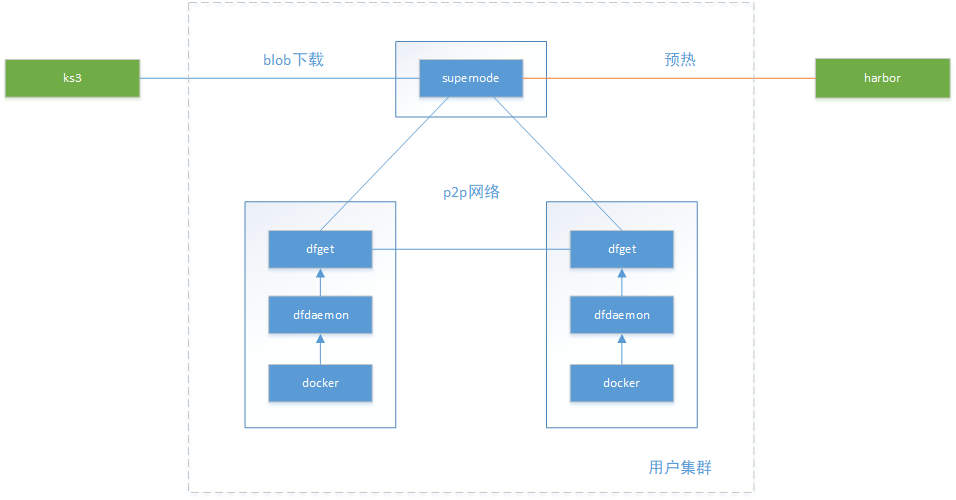

supernode部署在用户集群中，用户独享使用，用户承担supernode的资源。

按用户动态安装supernode，用deploy方式进行部署。

supernode到harbor/s3走kgw，harbor到supernode怎么办（影响预热）？

dfclient从supernode拉取数据更快。

dfclient部署在每个节点上，以daemonset方式部署。

部署架构-2
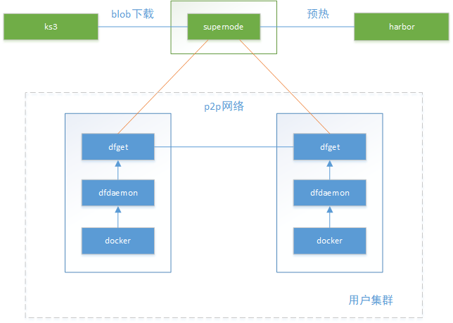


每个机房部署一套supernode服务，所有用户共享，不占用户资源。

部署方式没有要求。

supernode与harbor/s3双向通信都没问题。

supernode与dfclient之间组成p2p网络有问题吗？如果可行，不同用户的节点之间都是peer关系？

## 风险分析

### 部署dfclient后需要重启docker服务
集群每个节点需要安装dfclient，并配置为docker的HTTP代理，然后需要重启docker服务，对用户先用容器有多大影响。

产品层面是否做一个可选项，在创建集群时，如果用户选择p2p功能，就预先安装dfclient，并做好配置。

阿里云提供安装脚本，由用户在集群上自己安装，安装包含哪些具体操作待确认。

### 存储资源需求
缓存的镜像能否设置存储上限？

supernode缓存有效期 –peer-gc-delay 3min

dfget缓存有效期 –expiretime 默认3min

### 网络带宽限制
用户vpc内p2p下载对其他用户影响可忽略

配置p2p节点的网络限速：supernode节点可以设置最大占用的带宽，fdclient也可以设置带宽上限

### 适用场景应有针对性
拉取镜像的并发数要足够大，阿里云建议300台以上节点使用p2p效果较好。参与p2p的peer数量少的话，内网利用率不高，加速不明显。

不同节点要同时拉取镜像。dragonfly的peer会清理本地缓存，即便拉取同一镜像，两次拉取间隔大的话，还是需要重新组织p2p网，影响加速效果。

### 启用/禁用p2p下载功能
配置了HTTP代理后，所有镜像下载都会走dfdaemon代理，但用户并不一定要求一直使用p2p方式。

修改dfdaemon上配置规则，在p2p方式和直接代理之间进行切换。

复制配置规则的必要性和可行性，如某些镜像需要p2p，某些镜像走直接代理下载，是否开放用户配置？

### 需要评估适用于生产环境的合理配置
什么样的配置适合生成环境，配置项与集群规模有没有关系。

https://github.com/dragonflyoss/Dragonfly/blob/master/docs/config/supernode_properties.md

https://github.com/dragonflyoss/Dragonfly/blob/master/docs/config/dfdaemon_properties.md

https://github.com/dragonflyoss/Dragonfly/blob/master/docs/config/dfget_properties.md

# 附：Dragonfly宣称的性能数据

容器镜像分发比natvie方式提速可高达57倍；

registry网络出口流量降低99.5%以上；
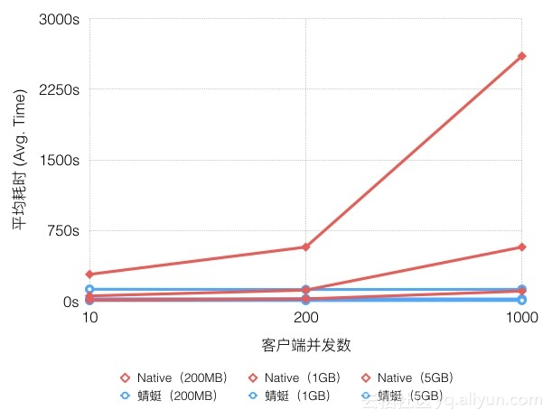


- 测试镜像大小：200MB、1GB、5GB

- 镜像仓库带宽：15Gbps

- 客户端带宽：双百兆bit/s网络环境

- 多并发：10并发、200并发、1000并发

随着下载规模的扩大，蜻蜓与Native模式耗时差异显著扩大，最高可提速可以达20倍。在测试环境中源的带宽也至关重要，如果源的带宽是2Gbps，提速可达57倍。

# 附：Ubur Kraken

## 简介

Kraken是Ubur开发的支持P2P传输的镜像仓库，用于混合云环境下的镜像管理、同步和分发和，它支持可插拔的存储后端。==还需要对接对象存储== 

2018年开始在Ubur内部使用，现已开源，https://github.com/uber/kraken
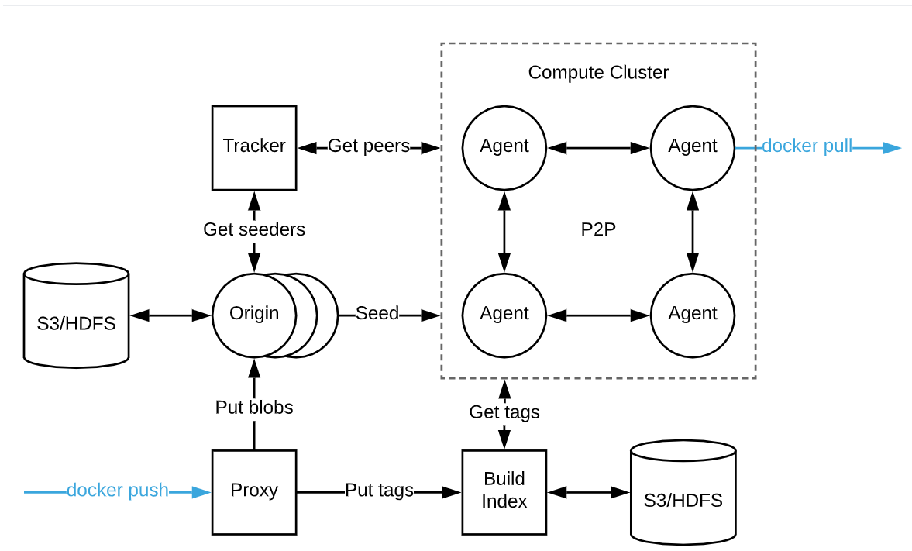

由少量专用的种子节点，为每个节点上的代理组成的网提供内容。

- origin/peer

专用的种子节点，可由多个orgin节点组成自愈的hash环。它们从后端的存储下载镜像blob，并保存到本地磁盘；

origin节点是特殊的peer，用来seed数据。

- agent/peer

部署在集群的每个节点上，它实现了docker registry接口，能够完成拉取镜像。

agent与traker和其他agent组成P2P网络，它定期向tracker汇报当前下载的torrent并从tracker获取提供当天torrent种子的peer列表，列表按一定的顺序组织，已经完成下载的perr在列表中排在靠前的位置。

agent从其他agent或origin下载数据。

- tracker

跟踪所有peer的下载进度，并基于此形成下载一个blob可以连接的peer列表。

多个tracker也可以组成自愈的hash环。

- proxy

实现了docker registry接口，用于上传镜像 -- 下载镜像强依赖这个上传逻辑吗？

- build-index

## 宣称性能数据

Ubur的一个集群达到每天分发100w个blob，其中包括10w个超过1G的blob；

峰值负载时， 在30秒内分发2w个100M-1G的blob；

可以用到节点下载速率的50%；

集群节点数量对下载速度影响不大，可支持15k的集群节点；

blob大小不受限，20G以下的性能较好；

从2600个节点下载一个2层的镜像，镜像大小3G，节点之间网速300MBps，有5个tracker和5个origon：

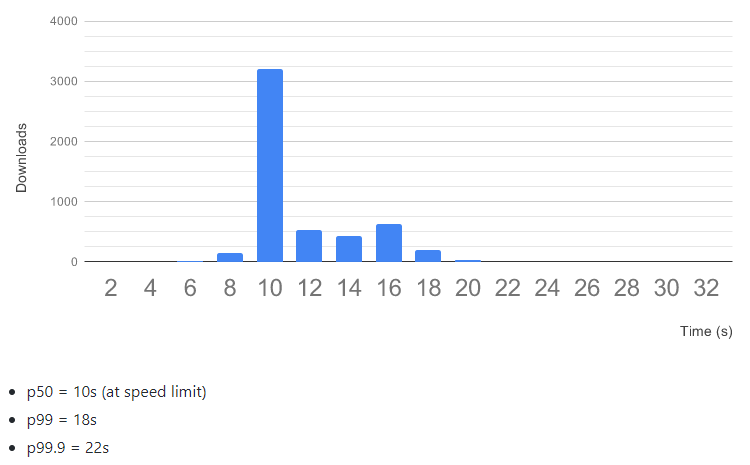
