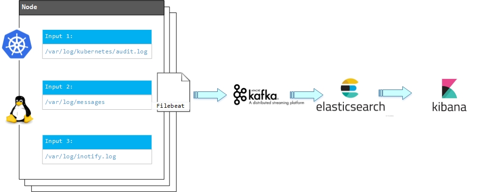
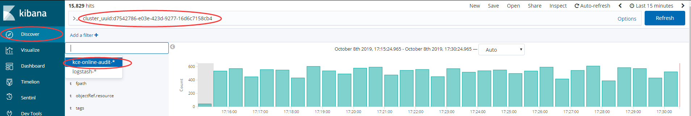
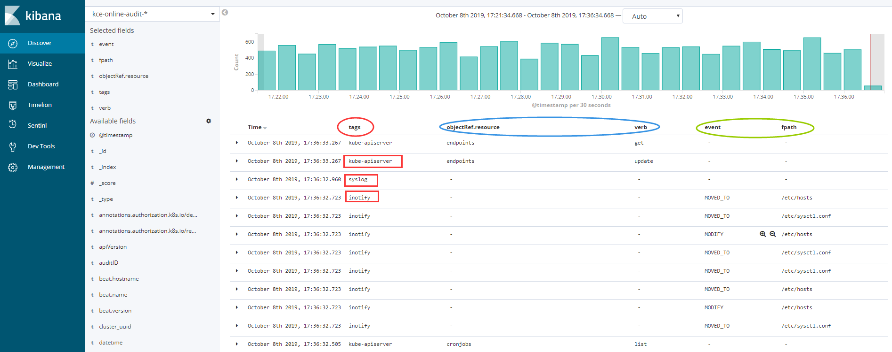
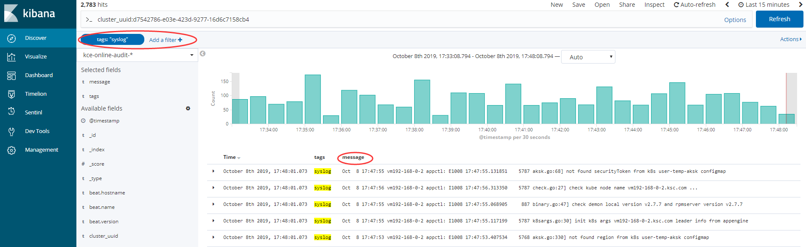

<!-- more -->

# 集群做了什么？产生了什么影响？

在容器引擎的日常运维中，经常遇到客户反馈线上问题，例如: cloud-controller-manager 服务无法启动，集群初始化卡状态，kubectl top no 命令返回错误，master节点某些pod被kill掉等；值班同学遇到这些问题时，通常会进入集群各个节点查看服务日志，找到产生问题的原因；经过一段时间对值班反馈问题的整理，发现线上服务出现异常的根本原因主要集中在以下几类： 1. 客户修改或删除集群服务配置文件  2. 客户勿删集群资源 3. 节点系统服务异常或资源不足 ；为了更加便捷高效的排查问题，我们引入了集群审计，用于追踪系统日志，配置文件变更，k8s资源操作，将集群在某个时间段内做了什么，产生了什么影响，变得一目了然。

# 服务架构



# 集群审计数据源
### Kubernetes-Audit
    kubernetes资源操作追踪审计日志

### 启动和配置
    kube-apiserver源生支持kubernetes集群操作审计功能，在启动kube-apiserver服务时加入以下参数即可：
```bash
--audit-policy-file=/etc/kubernetes/audit-policy.yaml  # 指定审计策略配置文件路径
--audit-log-path=/var/log/kubernetes/audit.log         # 指定审计日志输出路径
--audit-log-maxage=7                                   # 审计日志保留天数
--audit-log-maxbackup=4                                # 审计日志备份数量
--audit-log-maxsize=10                                 # 审计日志文件大小，文件超过指定大小后将循环覆盖写入
```

### kube-apiserver
```bash
/etc/kubernetes/manifests/kube-apiserver.yaml 展开源码
```

### 审计策略文件
```bash
/etc/kubernetes/audit-policy.yaml 展开源码
```

### Inotifywait
    inotify日志，记录集群节点文件变更（包括：创建，修改，删除，移动操作）

### 启动和配置
```bash
/usr/bin/inotifywait -mrq -d -o /var/log/inotify.log --timefmt '%Y-%m-%d %H:%M:%S' --format '{"datetime": "%T", "event": "%e", "fpath": "%w%f"}' -e create,delete,modify,move --exclude "(.swp|.inc|.svn|.rar|.tar.gz|.gz|.txt|.zip|.bak|.log|sed*[[:alpha:]])" /etc
```

### Syslog
    linux系统日志

### Filebeat
    Filebeat是一个轻量级日志传输Agent，可以将指定日志转发到Logstash、Elasticsearch、Kafka、Redis等中。Filebeat占用资源少，而且安装配置也比较简单，支持目前各类主流OS及Docker平台。

### 启动和配置
    /etc/filebeat/filebeat.yml 展开源码

# 审计日志汇总展示
## Kibana使用
Kibana服务地址：http://kibana.kce.ksyun.com:8601/app/kibana#/home?_g=()

进入Kibana页面后，导航栏中选择"Discover" => 在index下拉菜单中选择 "kce-online-audit-*" => 在页面最上面的输入框中输入 "cluster_uuid: ${cluster_uuid}" 按集群uuid过滤审计日志 => "回车"进行搜索查询


审计日志包含三个数据源，在审计中使用"tags"进行标识区分； objectRef.resource和verb 是 kube-apiserver字段，用于快速查看集群中哪些资源做了什么操作； event和fpath 是 inotify字段，用于快速查看哪些文件产生了哪些变更事件


由于syslog的message字段内容数据量大小不一致，切内容非格式化，故没有在Kibana展示模板进行单独配置，如果需要批量查看syslog审计日志可按tags过滤，并定义查看指定审计字段


